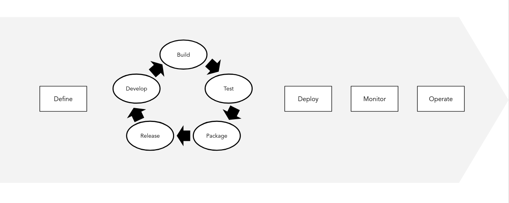

Table of Contents
=================

   * [Application Lifecycle Management](#application-lifecycle-management)
      * [Ocean Boards](#ocean-boards)
      * [Definition of Done (DoD)](#definition-of-done-dod)

---

This page describes the overall Ocean Application Lifecycle Management (ALM)

# Application Lifecycle Management

A more detailed view of the [Delivery pipeline](alm/delivery-pipeline.md) includes:

* Business definition
* Research
* Development

## Ocean Boards

In Ocean we use different Github boards to track different parts of the delivery process.

The main [Ocean Boards](alm/boards.md) in use are:

* [Business Board](alm/boards.md#business-board)
* [Development Board](alm/boards.md#development-board)
* [Research Board](alm/boards.md#research-board)
* [Engineering Board](alm/boards.md#engineering-board)

## Definition of Done (DoD)

A **Definition of Done (DoD)** is a common agreement of the team, defining what should happen to asses an issue has been completed.

The [Ocean Definition of Done](alm/definition-of-done.md) includes a common understanding about what we consider as Done or Completed from a development perspective.