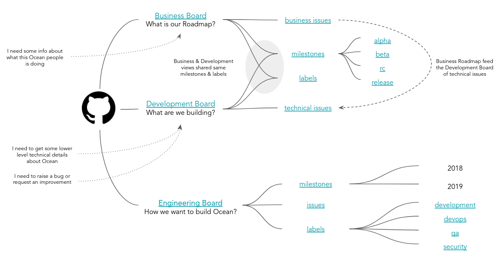
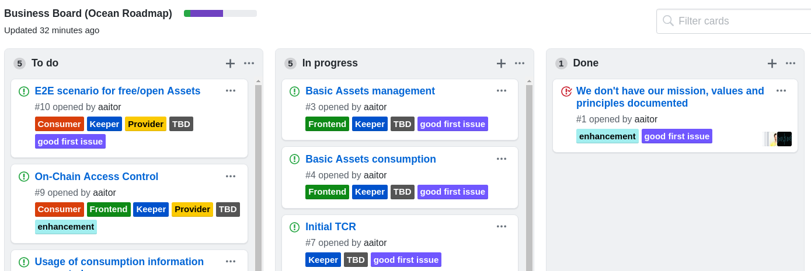
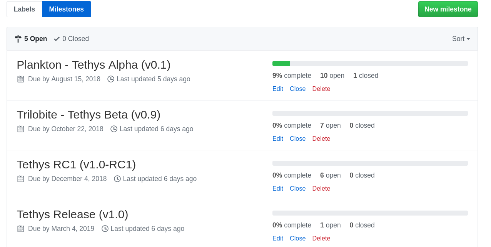
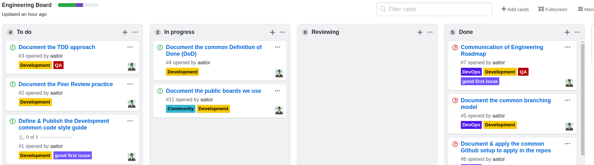

Table of Contents
=================

   * [Github Ocean Boards](#github-ocean-boards)
      * [Business Board](#business-board)
      * [Development Board](#development-board)
      * [Engineering Board](#engineering-board)

---

This page describes the boards in use regarding the core Ocean Network definition and development. Other complementary projects, for example developed by third party companies, could have their own boards to manage the delivery.

# Github Ocean Boards

From top to bottom, in the development and definition of Ocean we use different boards or views. Each of those have a different meaning:

## Business Board

The [Business Board](https://github.com/oceanprotocol/ocean/projects/1) includes the core Ocean Network roadmap from a high-level point of view.
It can be used to get a better understanding about the next steps and high-level features to be implemented.

The main users of this board are:

* Any Ocean or community member, needing to understand what is included in each Ocean release, and what is the high-level state of the implementation.
* Any Ocean or community member requesting a new Ocean Network feature

This board is maintained by the Ocean Product team, they are in charge of populate the scope of the Ocean Network, prioritized and organized by milestones.

Related with this board, some relevant information included is:

* [Ocean Protocol milestones](https://github.com/oceanprotocol/ocean/milestones?direction=asc&sort=due_date&state=open):
  - [Plankton Alpha version (v0.1)](https://github.com/oceanprotocol/ocean/milestone/1)
  - [Trilobite Beta version (v0.9)](https://github.com/oceanprotocol/ocean/milestone/2)
  - [Tethys RC (v1.0-rc1)](https://github.com/oceanprotocol/ocean/milestone/3)
  - [Tethys release (v1.0)](https://github.com/oceanprotocol/ocean/milestone/4)
* Business Issues/[Epic stories](https://github.com/oceanprotocol/ocean/issues?q=is%3Aopen+is%3Aissue+project%3Aoceanprotocol%2Focean%2F1)
* Categories/[Labels](https://github.com/oceanprotocol/ocean/labels)

This board should work as public interface with the community, showing the relevant and updated Roadmap we are implementing.

## Development Board

The [Development Board](https://github.com/oceanprotocol/ocean/projects/2) details the technical tasks we are working to implement the Ocean Network.
It can be used to get a better understanding about the state of the implementation of the different issues. It can include new features, bugs, etc.

The main users of this board are:

* The Ocean development team, using this in a daily basis during the delivery process. It should help to track the state of the implementations.
* Any community member requesting a new technical improvement or raising a bug
* Any community member, needing to understand some low level technical details about the Ocean implementation.

This board is maintained by the [Ocean Development team](https://github.com/orgs/oceanprotocol/teams/ocean-development).

Related with the **Development** board, some relevant information included is:

* [Ocean Protocol milestones](https://github.com/oceanprotocol/ocean/milestones?direction=asc&sort=due_date&state=open). This board shares the same milestones than the **Business Board**. It helps to relate the business requirements, with the technical issues implementing this
* [Technical Issues](https://github.com/oceanprotocol/ocean/issues?q=is%3Aopen+is%3Aissue+project%3Aoceanprotocol%2Focean%2F1) (Requirements or Bugs)
* [Labels](https://github.com/oceanprotocol/ocean/labels) (Same than the **Business Board**.)

This board should work as public interface with the Open Source community, including developers and early adopters. It should help to show in any moment, the implementation details of any Ocean requirement or bug.

## Engineering Board

The [Engineering Board](https://github.com/oceanprotocol/engineering/projects/1) includes the details about the next steps of the [Ocean Engineering Practice](https://github.com/oceanprotocol/engineering/).

The main objective of the Ocean Engineering practice is:

* Simplify what we do, we should avoid reinventing the wheel.
* Introduce the DevOps practice (CI + CD)
* Promote the quality and security.
* Communicate better what we do and why we are doing it. Our community needs information.
* Be more effective, make a better use of our time.
* Use some common good principles & patterns. Some of those can be useful.

The Engineer Board represents the state about how we are introducing those practices.

The main users of this board are the Ocean Development team. This board includes next steps and information about:

* Source Control Management
* Coding Style Guides
* DevOps
* Testing
* etc

This board is owned by the [Ocean Development team](https://github.com/orgs/oceanprotocol/teams/ocean-development). This team can raise new good practices, technologies, etc. to introduce as part of the Ocean Engineering practice.

Related with the **Engineering** board, some relevant information included is:

* [Engineering milestones](https://github.com/oceanprotocol/engineering/milestones?direction=asc&sort=due_date&state=open) (18Q2, 18Q3, 18Q4, 19Q1, ..)
* [Engineering Issues](https://github.com/oceanprotocol/engineering/issues) (Improvements to introduce to the Engineering practice)
* [Labels](https://github.com/oceanprotocol/engineering/labels). Main categories are:
  - [Development](https://github.com/oceanprotocol/engineering/labels/Development)
  - [DevOps](https://github.com/oceanprotocol/engineering/labels/DevOps)
  - [QA](https://github.com/oceanprotocol/engineering/labels/QA)
  - [Security](https://github.com/oceanprotocol/engineering/labels/Security)

This board is mainly for internal use. But we could make it public if we consider it includes relevant information for the community.

