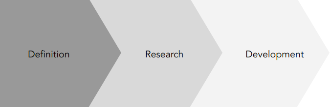
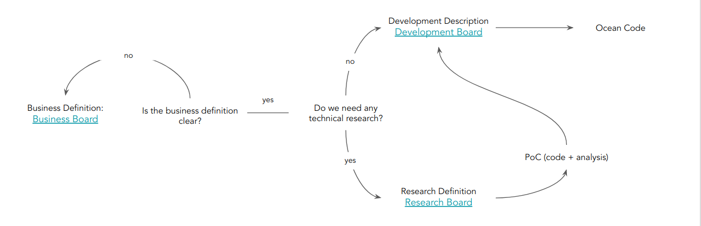

Table of Contents
=================

   * [Delivery Pipeline](#delivery-pipeline)
      * [Pipeline Steps](#pipeline-steps)
         * [Business Definition](#business-definition)
         * [Research](#research)
         * [Development](#development)

---

This page describes the usual Ocean Delivery Pipeline.

# Delivery Pipeline

The Delivery Pipeline describes how is the process of building Ocean, starting from the definition until the software delivery.
This is organize in the following steps:

## Pipeline Steps

The pipeline is organise in the following 3 high-level steps:

* Business Definition - Gathering requirements from internal or external users
* Research - Investigation of open technical questions
* Development - Software implementation and delivery

### Business Definition

The Business Definition process has the main intention of gathering all the requirements needed to be implemented in the Ocean product.
It should include enough details to have an idea about what is necessary to implement. All this information should be documented in the
[Business Board](https://github.com/oceanprotocol/ocean/projects/1).

A new issue or bug should include the following information:

* A clear title describing the issue
* A detailed enough description describing the business case
* A list of labels to categorize the issue
* A milestone associated, it should help to understand when it's necessary to implement the issue
* Optionally, any additional link or resource giving additional information

Having this information, the business and technical people can discuss further details or scope of the implementation.

### Research

After to have an initial business definition, if we have open technical questions to discuss, could be necessary to start a research process.
Typically in Ocean we are dealing with different kind of technologies, some of those in early stages, so this process is quite important to understand
what can be accomplished, the maturity state, etc.

When a Business issue require further technical investigation, a new issue should be raised in the [Research Board](https://github.com/oceanprotocol/ocean/projects/3).

The output of this Research process, should works as input of the development process. It means should provide:

* Github repository with working code (repos: `poc-*`)
* Documentation detailing the research made
* Conclusions

The following projects can be used as reference of good PoC's:

* [PoC TCR](https://github.com/oceanprotocol/poc-tcr)
* [PoC Salpchain](https://github.com/oceanprotocol/poc-salpchain)

### Development

Having enough business details, and optionally a Research PoC demonstrating the technical next steps, the final development process can be started.
A new issue can be raised in the [Development Board](https://github.com/oceanprotocol/ocean/projects/2), including all the technical details necessary to accomplish.

It should include the following information:

* A clear title describing the issue
* A detailed enough description describing the technical implementation to accomplish
* A list of labels to categorize the issue
* Link to the expected milestone
* Links to Business or Research issues in the other boards

A development issue can be considered as an **Epic** issue when is big enough. We don't have a formal definition of this, but if the development of the technical issue
can't be accomplished in the scope of one sprint, the issue is big enough to be considered an **Epic** story and be splitted in smaller issues.