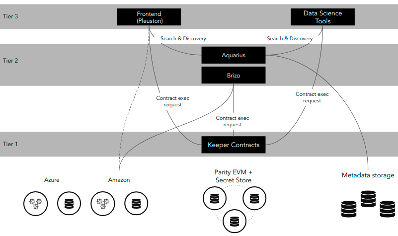
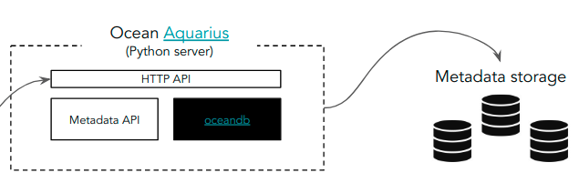

The Ocean Protocol network architecture is implemented based on [OEP-03/ARCH](https://github.com/oceanprotocol/OEPs/tree/master/3).

In the above diagram you can see the following components (from top to bottom):

- **Frontend** (Tier 3) - Application implemented using HTML + JavaScript + CSS, running in the client side (user's browser).
- **Data Science Tools** (Tier 3) - Applications executed by data scientists, typically getting access to the Ocean data and executing algorithms on top of that data.
- **Aquarius** (Tier 2) - Backend application providing Metadata storage and management services. Typically executed by Marketplaces.
- **Brizo** (Tier 2) - Backend application providing access control services, i.e. consumer access to publisher data or compute services. Typically executed by Publishers.
- **Keeper Contracts** (Tier 1) - Solidity smart contracts running on a decentralized Ethereum Virtual Machine (EVM).

## Components

### Tier 3 - Application Layer

#### Pleuston Frontend

Pleuston implements the template of a Marketplace. It's helpful to demonstrate some of the capabilities existing in Ocean.
It is not a final product, but can be used as reference to implement further Marketplaces using the existing code.
The Pleuston application implements the following high-level functionality:

- **Publishing** - Allows the user to publish new assets to the network.
- **Consuming** - Allows the user to list and consume published assets.
- **Marketplace** - Enables complex interactions and advanced capabilities like:
  - Publishing of Assets existing in cloud providers
  - Search and discovery of assets
  - Filtering
  - User registration using specific KYC processes (to be added)

Marketplaces will communicate with the following external components:

- **Smart Contracts** enable interaction with the Ocean Keeper Contracts that provide the market business logic. This integration is implemented using the [Ethereum Javascript API (web3.js)](https://github.com/ethereum/web3.js/).
- **Aquarius** enables access to assets made accessible to consumers, and facilitates the Metadata management of assets for the publishers. This communication happens using HTTP APIs.

The frontend application will subscribe to the EVM transaction log, enabling the receipt of asynchronous messages. This will facilitate the triggering of automatic actions when some events are raised (e.g. the request of an asset is triggered automatically when the purchase has been confirmed).

The Squid library showed in the above diagram encapsulates the logic to deal with the Ocean components (such as Keeper nodes and Aquarius nodes). Squid libraries (written in various programming languages) are part of the Tier 2.

#### Data Science Tools

Data science Tools are the interface to Ocean used by data scientists. Typically written in Python (but not limited to it),
those tools and libraries expose a high-level API allowing one to integrate Ocean capabilities in various computation pipelines.

### Tier 2 - Protocol Layer

Includes all the high-level libraries to interact with Ocean Protocol, and the enabler components complementing the Keeper Contracts.

#### Squid Libraries

Squid is a High Level specification API abstracting the interaction with the most relevant Ocean Protocol components.
It allows one to use Ocean capabilities without worrying about the details of the underlying Keeper Contracts or Metadata storage systems.

The Squid API can be implemented in many different languages, initially [JavaScript](https://github.com/oceanprotocol/squid-js) (used in Pleuston) and [Python](https://github.com/oceanprotocol/squid-py) (used in the data science tools).

The complete specification of [the Squid API can be found in the oceanprotocol/dev-ocean repository on GitHub](https://github.com/oceanprotocol/dev-ocean/blob/master/doc/architecture/squid.md).

#### Aquarius

Aquarius is a Python application running in the backend that enables Metadata management. It abstracts access to different Metadata stores, allowing Aquarius to integrate different Metadata repositories. The OceanDB plugin system can integrate different data stores (e.g. Elasticsearch, MongoDB, BigchainDB) implementing the OceanDB interfaces.

The high-level architecture of Aquarius is shown in the following diagram:

#### Brizo

Brizo is a component providing capabilities for Publishers.
It interacts with the Publisher's cloud and/or on-premise infrastructure.
The most basic scenario for a Publisher is to provide access to the Assets the Publisher owns or manages.
In addition to this, other extended services could also be offered, e.g.

- Computing on top of the data without moving the data
- Storage services for new derived assets
- Gathering of Service Proofs - Enables different kind of service proofs from different providers. For example - allowing the retrieval of receipts from cloud providers to validate service delivery.
- On-Chain Access Control - Brizo is in charge of the on-chain validation that a consumer is entitled to get access to an asset or service. This happens by integrating with the Keeper from the Brizo side.

### Tier 1 - Decentralized VM Layer

#### Keeper Contracts

The Keeper Contracts are Solidity smart contracts deployed and running in the decentralized [Ethereum Virtual Machine (EVM)](https://github.com/ethereum/wiki/wiki/Ethereum-introduction#about-ethereum).

The Ocean Keeper implementation is where we put the following modules together:

- **Token Curated Registries (TCRs)** - Users create challenges and resolve them through voting to maintain registries.
- **Ocean Tokens** - The intrinsic tokens circulated inside the Ocean Network, which is used when voting within TCRs.
- **Curated Proofs Market** - The core component where people can transact with each other and curate assets through staking with Ocean tokens.

## Interactions

### Asset Registration

### Asset Consumption

The lower level details about the consumption are included in the On-Chain Access Control section below.

### On-Chain Access Control

You can find more information about the complete On-Chain Access Control implementation in the [OEP-11](https://github.com/oceanprotocol/OEPs/tree/master/11). 
