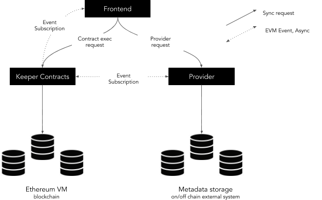
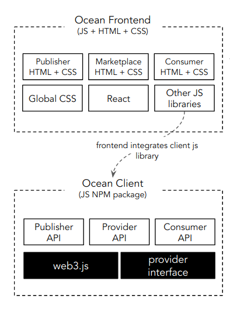
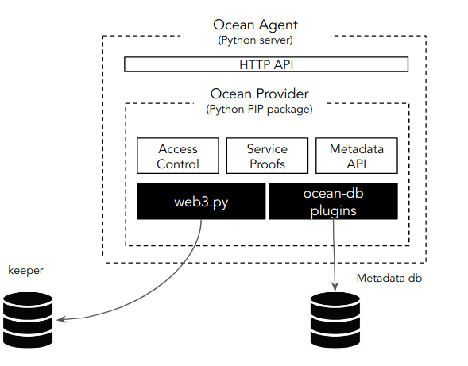
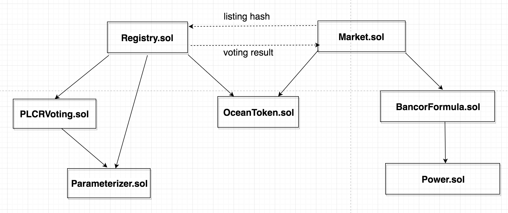
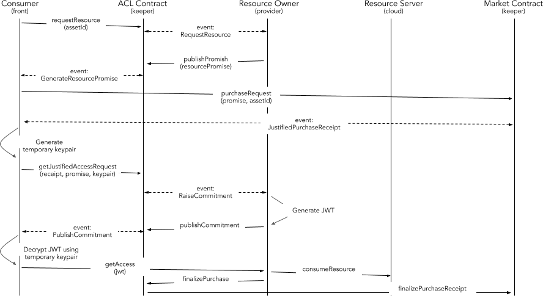

Table of Contents
=================

   * [Architecture](#architecture)
      * [Components](#components)
         * [Frontend](#frontend)
         * [Keeper Smart Contracts](#keeper-smart-contracts)
         * [Provider](#provider)
      * [Interactions](#interactions)
         * [Assets registering and consumption](#assets-registering-and-consumption)
         * [On-Chain Access Control](#on-chain-access-control)
      * [Project Repositories](#project-repositories)

---

This page is a central point for documenting the Ocean Architecture.

# Architecture

In the image below you can see a diagram of the initial High-Level Ocean Network Architecture:

In the above diagram you can see the following components (from top to bottom):

- **Frontend** (Tier 3) - Application implemented using HTML + Javascript + CSS, running in the client side (user's browser).
- **DataScience Tools** (Tier 3) - Applications executed by datascientists, typically getting access to the Ocean data and executing algorithms on top of that data
- **Provider** (Tier 2) - Backend application providing some advanced network services. Executed typically by Marketplaces. Initially:
  - On-Chain access control.
  - Metadata storage.
  - Gathering of service proofs.
- **Brizo** (Tier 2) - Backend application allowing to provide additional services to Publishers (Compute)
- **Keeper Contracts** (Tier 1) - Solidity Smart Contracts running on the decentralized Ethereum Virtual Machine (EVM).

## Components

### Tier 3 - Application Layer

#### Pleuston Frontend

Pleuston implements the template of a Marketplace. It's helpful to demonstrate some of the capabilities existing in Ocean.
It is not a final product, but can be used as reference to implement further Marketplaces using the existing code.
**Pleuston** application implements the following high-level functionalities:

- **Publishing** - Allows the user to publish new assets to the network.
- **Consuming** - Allows the user to list and consume published asset's.
- **Marketplace** - Enables complex interactions and advanced capabilities like:
  - Publishing of Assets existing in cloud providers
  - Search and discovery of assets
  - Filtering
  - User registration using specific KYC processes (To be added)

Marketplaces will be running on the client side and will communicate with the following external components:

 - **Smart Contracts**. Enables interaction with the Ocean Smart Contracts that provide the Market business logic. This integration is implemented using the [Ethereum Javascript API (web3.js)](https://github.com/ethereum/web3.js/).
 - **Provider**. Enables access to asset's made accessible to consumers, and facilitates the Metadata management of assets for the publishers. This communication happens using HTTP API's.

The frontend application will subscribe to the EVM transaction log, enabling the receipt of asynchronous messages. This will facilitate the triggering of automatic actions when some event(s) is raised (i.e. the request of an asset is triggered automatically when the purchase has been confirmed).

The Squid library showed in the above diagram encapsulates the logic to deal with the Ocean components (Keeper & Provider). Squid libraries in different languages are part of the Tier 2.

#### Datascience Tools

Datascience Tools are the interface to Ocean used by datascientists. Typically in Python (but not limited to it),
those tools and libraries expose a high-level API allowing to integrate the Ocean capabilities in different kind of computation pipelines.

### Tier 2 - Protocol Layer

Includes all the high-level libraries to interact with Ocean Protocol, and the Enabler components complementing the Smart Contracts.

#### Squid Libraries

Squid is a High Level specification API abstracting the interaction with the most relevant Ocean Protocol components.
It allows to use the Ocean capabilities without requiring to know the complexity of Smart Contracts or Metadata storage systems.

Squid API as specification, can be implemented in different languages, initially [Javascript](https://github.com/oceanprotocol/squid-js) (used in Pleuston) and [Python](https://github.com/oceanprotocol/squid-py) (used in the Datascience tools).

The complete specification of the [Squid API](architecture/squid.md) can be reviewed as part of this repository.

#### Provider

The Provider is an application running in the backend (Python) that enables some advanced network capabilities:

- Metadata Management - Abstracts access to different Metadata stores, allowing Providers to integrate different metadata repositories. The OceanDB plugin system can integrate different datastores (ElasticSearch, MongoDB, BigChainDB) implementing the Oceandb interfaces.
- Gathering of Service Proofs - Enables different kind of service proofs from different providers. For example - allowing the retrieval of receipt's from cloud providers to validate service delivery.
- On-Chain Access Control - The Provider is in charge of the on-chain validation that a consumer is entitled to get access to an asset or service. This happens by integrating with the Keeper from the Provider side.

The high-level architecture can be seen in the following diagram:

#### Brizo

Brizo is component providing additional capabilities to the **Publishers**. It allows to interact with the cloud and/or on-premise infrastructure, enabling to provide additional services on top of the data.
The most basic scenario of a Publisher, is to provide access to the Assets this Publisher owns or manage. In addition to this, other extended services could be offered as extension to this.
Brizo enables, interacting with the infrastructure providers, to build additional services based in that infrastructure like:

* Computing on top of the data without moving the data
* Storage services for new derived assets

### Tier 3 - Decentralized VM Layer

#### Keeper Smart Contracts

The Keeper Smart Contracts are Solidity Smart Contracts deployed and running in the decentralized [Ethereum Virtual Machine (EVM)](https://github.com/ethereum/wiki/wiki/Ethereum-introduction#about-ethereum).

The Ocean Keeper implementation is where we put the following modules together:

- **TCRs** - Users create challenges and resolve them through voting to maintain registries.
- **Ocean Tokens** - The intrinsic tokens circulated inside the Ocean Network, which is used in the voting within TCRs;
- **Curated Proofs Market** - The core component where people can transact with each other and curate assets through staking with Ocean tokens.

## Interactions

### Assets registering and consumption

The lower level details about the consumption are included in the On-Chain Access Control section.

### On-Chain Access Control

## Project Repositories

The Ocean Github project repositories can be found in the [repositories section](architecture/repos.md).

