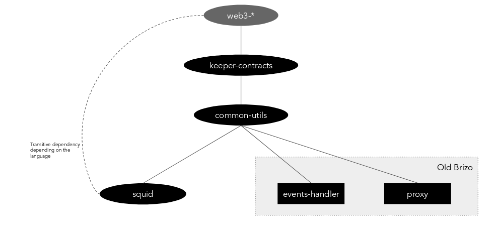

```
shortname: BRIZO-RELOADED
name: Improvements to apply to Ocean Brizo component
type: Standard
status: Raw
editor: Aitor Argomaniz
contributors: 
```


Table of Contents
=================


# How to improve Brizo?

## Introduction

Currently Brizo is one of the core components of Ocean Architecture. Brizo was created to help the Publishers and Providers in their tasks of make available the data and services they are providing. It implements the OEP-11 acting as a key component of the Ocean stack.

In the current architecture, Brizo is one micro-service with 2 main responsibilities:

1. Listening multiple Service Execution Agreements Keeper events and doing some stuff depending on the conditions. For example, when a payment is locked by the Consumer, Brizo grants access to an asset.
2. REST API allowing to consume assets and publish assets (mainly for JS applications)

The scope of this document is to understand better the current responsibilities of Brizo and understand how to improve it allowing to support additional use cases and make it easier to implement and maintain the new features.

## Refactoring tasks

The improvements are separated in 3 different areas:


### Separation of concerns

As was detailed before, Brizo is doing 2 totally different things. The first recommendation is to separate both concerns in 2 totally independent projects:

#### Events Handler

The events handler must be a backend agent in charge of react to the events emitted by SEA. This logic needs to be separated from the current brizo server as a totally different repository. 

This software doesn't listen any port, is running in the backend doing the Publisher dirty job of reacting to the on-chain changes.


#### Assets Proxy

Very simple proxy with 2 different responsibilities:

1. REST API allowing the publishing of Assets on behalf of the Publisher. In this case, the user running the Proxy (Provider) will assign himself as authorized Provider on-chain, allowing to encrypt/decrypt via Secret Store.
2. Access Proxy allowing to the consumers providing the proper serviceAgreementId, did, signature, etc. to consume a previously purchased asset.


### Software architecture refactor


#### Separation of brizo and squid logic

Currently the Brizo project is highly coupled to squid-py. This is not the best situation because squid-py was created with the intention of exposing a clear and thin API to the Ocean Protocol users. But in the Python implementation is including some of the business logic required by Brizo converting squid-py in something different in the python version.

All the Brizo business logic must be in the brizo repositories (events handler or proxy) and never in squid


#### Separation of duties

To facilitate the previous task, Squid needs to separate some business logic in some different libraries/components:




Reviewing the above diagram from top to bottom:

* web3 is the external implementation of web3 in the different languages. This is a dependency (transitive or direct depending on the implementation language) of all the different projects requiring to interact with the on-chain services
* keeper-stus are the different Keeper Contracts artifacts generated in the 3 different languages. Includes the ABI's and the interfaces to interact with Keeper Contracts. It has as dependency the web3 library. The different stubs are generated by the Keeper Contracts project.
* web3-utils is a new library that imports web3. It provides the utilities to around web3 to interact with on-chain services. It could facilitate listening events, call some JSONRPC functions, etc. The scope must be limited to web3 functions.
* commons is a new helpers library where mainly you can find common methods about encoding, crypto, etc. It's not having any dependency with keeper or web3.
* events handler is having 2 main dependencies: 
  - keeper-stubs to interact with the SEA keeper contract calling directly to the existing methods
  - web3-utils to facilitate the interaction with web3 functionalities
  It's important to notice that events-handler is not having any dependency with squid library. It could have a dependency with commons or web3 directly if were needed
* proxy interacts imports keeper-stubs and commons. Like events-handler it doesn't have any dependency with squid
* squid in this diagram is having less responsibilities. All the all brizo logic is moved to events-handler and proxy projects. All the commons/helpers and web3 functions to the relevant projects.


The events handler currently is including the business logic about listening events hardcoded. 

### Unification of events listening


In the current version implements OEP-11 and includes 4 different 

```
EscrowAccessSecretStoreTemplate::AgreementCreated(
        bytes32 indexed _agreementId,
        bytes32 _did,
        address indexed _accessConsumer,
        address indexed _accessProvider,
        uint[]  _timeLocks,
        uint[]  _timeOuts
    );

LockRewardCondition::Fulfilled(
        bytes32 indexed _agreementId,
        address indexed _rewardAddress,
        bytes32 _conditionId,
        uint256 _amount
    );

AccessSecretStoreCondition::Fulfilled(
        bytes32 indexed _agreementId,
        bytes32 indexed _documentId,
        address indexed _grantee,
        bytes32 _conditionId
    );

EscrowReward::Fulfilled(
        bytes32 indexed _agreementId,
        address indexed _receiver,
        bytes32 _conditionId,
        uint256 _amount
    );
```

Each event is emitted by a different Smart Contract/address. This requires having 4 events watchers per Brizo instance handling with all the events created. Each Brizo instance should filter by only the events associated with the provider address.

If all those events are moved to the same base Smart Contract and the events generalized to a common structure, we could have a single point generating the SEA flow events (OEP-11, etc.). 

Suggestion of a new common event for the SEA flows:

```
ConditionsBase::SeaWave(
        uint    indexed _source,        // 0 - AgreementCreated, 1 - LockRewardCondition.Fulfilled, etc 
        address indexed _provider,      // Provider associated with the transaction, will be the one picking the event 
        bytes32 indexed _agreementId,   // Service Agreement Id
        bytes32         _did,           // DID associated to the event
        address         _consumer,      // Address of the SEA Consumer,
        bytes32         _conditionId,   // ID of the condition    
        ); 
```

In the above event description, the `_source` parameter indicates what type of event is triggered. Taking into account the OEP11 and events managed:

* 0 - EscrowAccessSecretStoreTemplate::AgreementCreated
* 1 - LockRewardCondition::Fulfilled
* 2 - AccessSecretStoreCondition::Fulfilled
* 3 - EscrowReward::Fulfilled

Having this events setup would allow to the events handler to listen only one event comming from the same Smart Contract address. Brizo would only require one listener subscribed to the `SeaWave` event filtering for the `_provider` address to react only to the relevant events.

When a specific event type is captured different "EventProcessors" can exist in the system. Those EventProcessors could:

* Implement a Processor interface describing the behaviour that must be implemented by the Processors
* Extend a base EventProcessor abstract class having some common functionality for all the Processors
 
For example if we have the FulfilledLockRewardProcessor:

`class FulfilledLockRewardProcessor extends SEABaseProcessor implements EventProcessors`

In the Brizo configuration we could have a mapping between the type of SEA events received (0, 1, 2, 3, ..) and the "Processor" in charge of do some action when a specific event is triggered. Example:

```
..
event.source.0.processor="com.oceanprotocol.events.EscrowAccessSecretStoreAgreementCreatedProcessor"
event.source.1.processor="com.oceanprotocol.events.FulfilledLockRewardProcessor"
..
```


