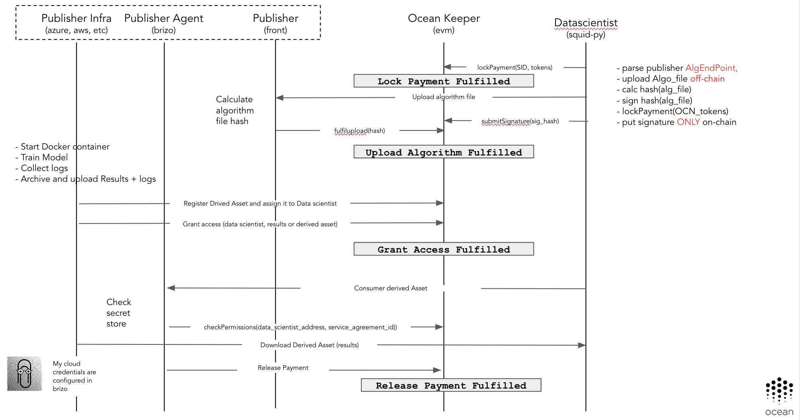

Table of Contents
=================

  * [Table of Contents](#table-of-contents)
   * [Motivation](#motivation)
   * [Architecture](#architecture)
      * [Enabling Publisher Services (Brizo)](#enabling-publisher-services-brizo)
      * [Responsibilities](#responsibilities)
      * [Initial solution](#initial-solution)
      * [Next steps](#next-steps)

---

This page describes the highlights of the integration of additional computing services.

# Motivation

The most basic scenario of a Publisher, is to provide access to the Assets this Publisher owns or manage. In addition to this, having this data ecosystem in place,
Publishers could offer other related services in top of this. Some possibles scenarios are:

* The Publishers offer as a service the possibility of execute some computation on top of their data. This has some benefits:
  - The data never leaves the Publisher enclave
  - It's not necessary to move the data, the algorithm moves to the data
  - Data Protection Regulation. Having only the data once and not moving it, makes easier to be compliant to the Data Protection Regulations applying to your data

* Storage services for new derived assets. As a result of the computation of the existing datasets, a new derived dataset could be created. Publishers could offer an additional service to make use of their existing storage capabilities.
  This is always optional, being possible to the users using the compute services, to download the new derived datasets created as a result of this computation.

# Architecture

## Enabling Publisher Services (Brizo)

The direct interaction with the infrastructure where the data is, requires the execution of a component handled by Publishers.
This component will be in charge of interact with the users, and manage the basics of own Publisher infrastructure to provide the additional services.
This business logic supporting the some additional Publisher capabilities, is responsibility of a new technical component.

The main & new key component introduced to support new Publisher services is named **Brizo**.

_"Brizo is an ancient Greek goddess who was known as the protector of mariners, sailors, and fishermen. She was worshipped primarily by the women of Delos, who set out food offerings in small boats. Brizo was also known as a prophet specializing in the interpretation of dreams."_

In the "Ocean ecosystem", Brizo is the technical component executed by the **Publishers** allowing to them to provide extended data services.
Brizo, as part of the Publisher ecosystem, includes the credentials to interact with the infrastructure (initially cloud, but could be on-premise).
Because of those credentials, the execution of Brizo **SHOULD NOT** be delegated to a third-party.

## Responsibilities

The main responsibilities of the software are:

* Expose a HTTP API allowing to execute some extended data services (compute and/or storage)
* Authorize the user on-chain using the proper Service Agreement. It allows to validate that user requesting the service is allowed to use that service.
* Interact with the infrastructure (cloud/on-premise) using the Publisher credentials.
* Start/stop/execute computing instances with the algorithm's provided by the users
* Retrieve the logs generated during the executions
* Register new Assets derivated of the executions as new Ocean Assets
* Provide **Proofs of Computation** to the Ocean Network

## Initial solution

In the above diagram you can see the initial integration supported. It involves the following components/actors:

* Data scientists - Final users requiring to use some computing/storage services where the data they are using is.
* Ocean Keeper - In charge of maintain the Service Agreements and supporting the on-chain authorization
* Publisher Infrastrucure - Cloud or On-Premise. Is were the Publisher data is.
* Publisher Agent (Brizo) - Orchestrate/provides the additional publisher services
* Publisher - Is the user owning the data and running Brizo. He/she doesn't interact actively in this flow.

The pre-conditions of this flow are:

* In a **previous stage** to this flow, the data scientist got access to an Asset (dataset) thru a classical purchase process
* The data scientist owns or has access to an Asset of type Algorithm registered in Ocean
* The Algorithm is implemented in one of the languages/frameworks supported by the Publisher
* The Publisher, specified in the Asset DDO the endpoint exposed by the Publisher (Brizo) to expose the computing services

The interactions showed in the diagram are:

1. The Data scientist, after parse the DDO and see that Publisher exposes a computing service, (using Squid) call the `executeAlgorithm` method of the Publisher Brizo instance. The following parameters are given:
   - The publicKey of the data scientist
   - The `serviceAgreementId` related with the purchase of the Asset
   - The `algorithmDID`
   - Name and tag of the Docker image to execute (e.g. `alpine-python:3.6`, `tensorflow:1.9`, etc.)
1. The Publisher Agent (Brizo), checks the access permissions of the Data scientist for the `serviceAgreementId` given quering the Keeper
1. If the Data scientist has permissions, Brizo starts a container in the Publisher infrastructure, mounting as Volume the Dataset related with the Service Agreement
1. Brizo resolves the Algorithm DID, download the Algorithm content and copy to the container
1. Brizo run the algorithm in the container
1. Brizo pull the logs periodically
1. After finish the execution of the algorithm, Brizo returns the status
1. Brizo register as a new Asset of the system the output file generated. The owner of this new Asset will be the Data scientist.
1. The Keeper resolve the Service Agreement

## Next steps

Next steps are:

* Integrate different cloud providers/on-premise infrastructure
* Support different kind of container flavours allowing to execute different kind of algorithms
* Model extended service agreements supporting richer services

