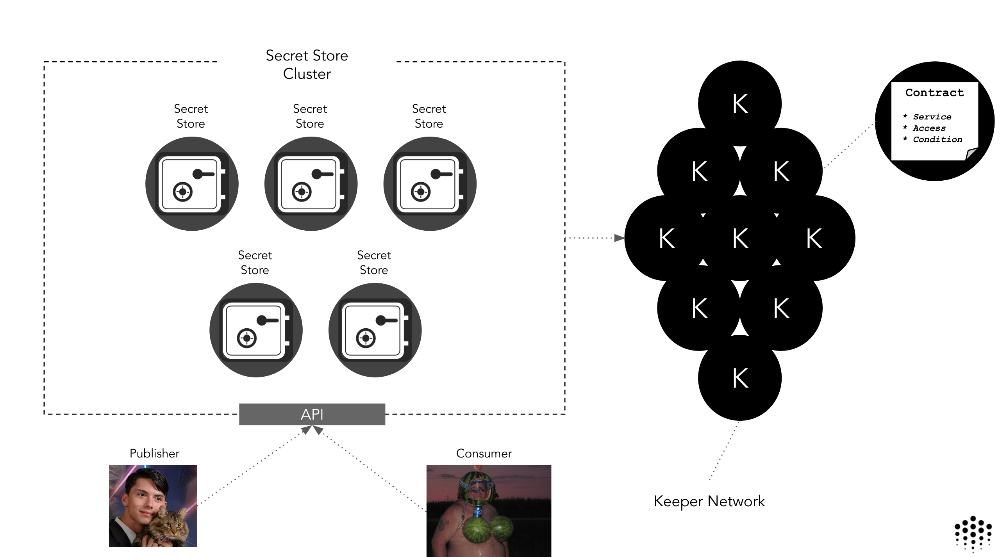
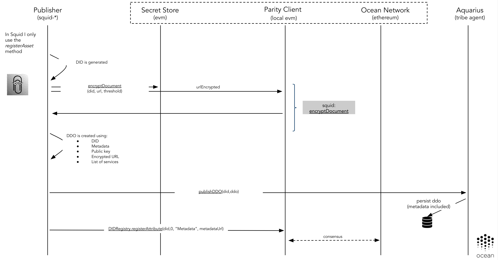
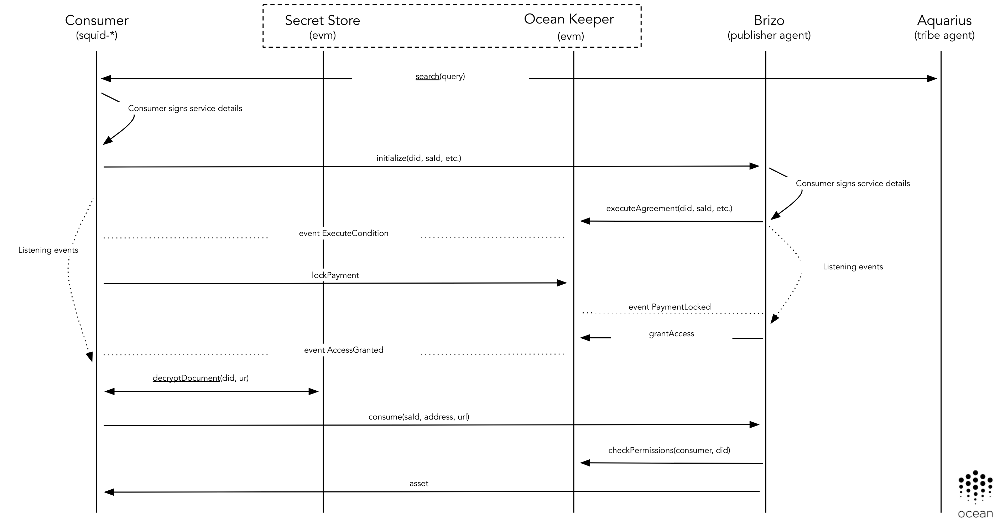
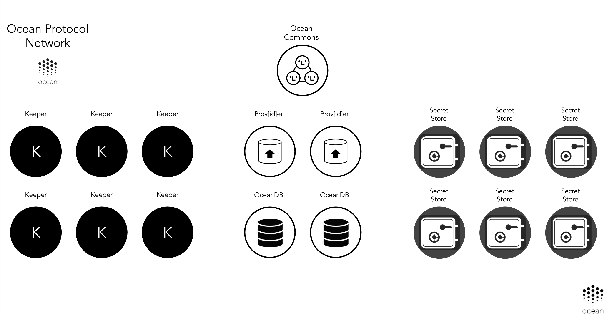

## Motivation

The initial implementation of Ocean Protocol, detailed in [OEP-10](https://github.com/oceanprotocol/OEPs/tree/master/10) required Publishers, Consumers, Providers and Smart Contracts to set up a complete negotiation between them.
This integration was difficult and had to scale to support delegation of permissions. The complexity was a potential source of errors.
Because of that, we investigated alternative approaches to achieve a more secure and scalable way to share secrets between parties.

## Introduction

Parity Secret Store is a feature included as part of the [Parity Ethereum](https://www.parity.io/ethereum/) client that allows users to store a fragmented ECDSA key on the blockchain, such that retrievals are controlled by a permissioned Smart Contract.

The Secret Store implements a threshold retrieval system, so individual Secret Store nodes are unable to reconstruct the keys to decrypt documents by themselves.
A Secret Store node only saves a portion of the ECDSA key. The decryption key can only be generated if a consensus is reached by an amount of Secret Store nodes bigger than the threshold that the publisher of the secret chooses.

From the [Parity Secret Store documentation](https://wiki.parity.io/Secret-Store):

> The Parity Secret Store is core technology that enables:

> - distributed elliptic curve (EC) key pair generation - key is generated by several parties using special cryptographic protocol, so that:
>   - private key portion remains unknown to every single party;
>   - public key portion could be computed on every party and could be safely exposed to external entities;
>   - every party hold the ‘share’ of the private key;
>   - any subset of t+1 parties could unite to restore the private portion of the key;
>   - any subset of less than t+1 parties could not restore the private portion of the key;
> - distributed key storage - private key shares are stored separately by every party and are never exposed neither to another parties, nor to external entities;
> - threshold retrieval according to blockchain permissions - all operations that are requiring private key, require at least t+1 parties to agree on ‘Permissioning contract’ state.

This last point can enable to Ocean Protocol to have a solid mechanism to distribute encrypted contents between parties (Consumers and Publishers),
and these contents can only be decrypted after an on-chain authorization phase.

## Architecture

The integration of the Secret could have the following characteristics:

- All the negotiation required to encrypt or decrypt a resource is happening without writing any information on-chain
- This integration only requires standard HTTP requests between the clients (Consumer, Publisher) and the Parity EVM & Parity Secret Store API's (no gas, quick)
- Requires the usage of the Parity EVM Secret Store API existing in the Parity Ethereum clients
- Requires the usage of the Parity Secret Store API. This software is part of the Parity Ethereum client
- It's based in the usage of a permissioned Secret Store cluster. This cluster would be deployed/governed by the Ocean Protocol Foundation at network launch as part of the base Ocean core capabilities. Additional parties (user/companies/organizations) could be added as members to decentralize the responsibility of running this infrastructure.
- Publishers and Consumers could use their own Parity Secret Store cluster. The cluster to use is part of the Squid configuration used by the different users of Ocean.



### Encryption

The standard Parity Secret Store publishing flow is the following:


This flow was implemented in various Ocean Protocol Secret Store clients:

- [Java Secret Store client](https://github.com/oceanprotocol/secret-store-client-java)
- [Python Secret Store client](https://github.com/oceanprotocol/secret-store-client-py)
- [JavaScript Secret Store client](https://github.com/oceanprotocol/secret-store-client-js)

and is abstracted as part of the `encryptDocument` Squid method.
A Publisher (such as Alice in the diagram above) can use `encryptDocument` to encrypt a document and to store the decryption key in the Secret Store cluster.

The type of document to encrypt is totally flexible. A document could be one or multiple URLs, access tokens to an external resource, etc.
Typically in Ocean, during the Asset access phase, what we are decrypting is the URL to get access to an Asset that is stored in a cloud provider.

This could be extended in the future allowing configuration of access policies at runtime. This would allow the granting of access to specific IP addresses to get access to assets, after the authorization phase.

The following diagram illustrates how a Secret Store integrates into the Ocean publishing flow:



As a result of this flow, the encrypted document can be shared with the potential Consumers (e.g. as part of the Metadata or via [libp2p](https://libp2p.io/)).

The action of granting permissions on-chain to a specific user is not part of this flow.

### Decryption

The standard Parity Secret Store consuming flow is the following:


This logic is encapsulated as part of the `decryptDocument` Squid method. This method allows a Consumer, given a resource unique id and a encrypted document (shared for the Publisher via Metadata or libp2p), to decrypt this document using the Secret Store cluster capabilities.

Decryption only can be achieved if the Secret Store cluster achieves the quorum specified by the Publisher during the publishing process with the **threshold** attribute.

The Secret Store checks the user's authorization permissions on-chain to determine if they are authorized to decrypt a document. The Secret Store won't allow decryption if the user doesn't have authorization.

The following diagram illustrates how a Secret Store integrates into the Ocean asset consumption flow:



### Authorization

The Consumer on-chain authorization will be implemented using the Secret Store ACL capabilities.
In the Secret Store configuration, an address of the authorization Smart Contract can be configured:

```solidity
acl_contract = "6d6a34f2be1e76902a2fde049f317610cdf453eb"
```

Doing that, during the decryption phase, the Secret Store will call to the `checkPermissions` method of that address passing as parameter the following attributes:

* public key of the user trying to get access or decrypt
* document key id to check if user has permissions

Using this capability, a simple `checkPermissions` method could be as following:

```solidity
  // Checks if a specific user has grants to access using the acl mapping
  function checkPermissions(address user, bytes32 document) constant public returns (bool) {
    require(acl[document][user].canRead == 1, 'User was not whitelisted');
    return true;
  }
```

This could be easily adapted to use the Service Agreements approach.

## Deployment

The Secret Store functionality is provided by a permissioned cluster that will be executed as part of the Ocean Protocol basic infrastructure.

Nodes can only be added to this cluster by changing the configuration of the members of the cluster, so a third-party malicious user can't join the cluster without changing the configuration of the other nodes.

```text
[secretstore]

// Here the list of all the nodes part of the Secret Store cluster
nodes = [
  "97ca0129faba1e3d69c79bd49f186c4e0732d240fb05b2351d77f2490958d5c4396ae2f6f56f37177f3442896a590c8e73486d0cb956aa794d156cb69c88cf9d@127.0.0.1:8011",
  "2a81fad8d8a3c932a06c724bb1034850f228de8afdadabd1e13f71cedc0e58fac7814dc3f269630f2edef388906a7d7de6f6d1a2c448db03de19fa133f396db1@127.0.0.1:8012",
  "4824f1e7b73ff964a0f0026679d0ff4a88c22722bbc8ea571029b7a0e893ee68d5d299e86b70633ed5dd80c85ef7b8c11169a6a8fd4a4e914b4d10011a61b0b3@127.0.0.1:8013"
]
```

Taking this into account, and to facilitate normal operation at network launch, the Ocean Protocol Foundation will run a Secret Store cluster in different cloud locations providing good performance and high-availability.
In following phases, the governance of the basic infrastructure could be shared with different organizations, to decentralize the control of that infrastructure.

At network launch, the initial Ocean network deployment could include the following basic infrastructure:

- A pool of Parity Ethereum client nodes with the Ocean Keeper Contracts deployed to them. (They might form a stand-alone PoA network or be part of the Ethereum Mainnet.)
- A Secret Store cluster allowing the sharing of secrets between parties.
- A possible Commons Marketplace with its own Aquarius and Brizo nodes. It would be used to demonstrate Ocean capabilities using free/open assets.



## Links

- [Parity Secret Store](https://wiki.parity.io/Secret-Store)
- [ECDKG: A Distributed Key Generation Protocol Based on Elliptic Curve Discrete Logarithm](http://citeseerx.ist.psu.edu/viewdoc/summary?doi=10.1.1.124.4128&rank=1)
- [Secret Store Proof of Concept](https://github.com/oceanprotocol/poc-secret-store)

<repo name="secret-store-client-js"></repo>
<repo name="secret-store-client-py"></repo>
<repo name="secret-store-client-java"></repo>
