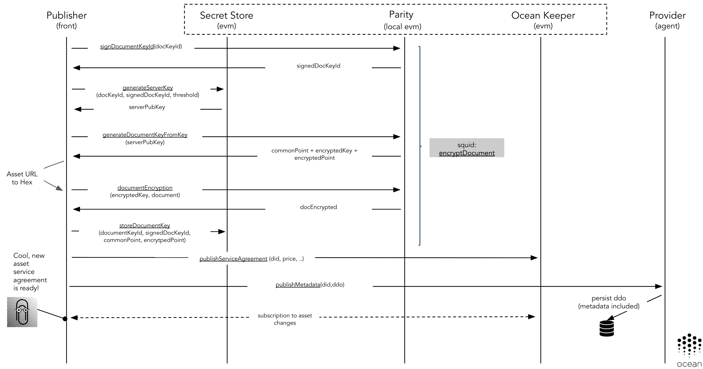
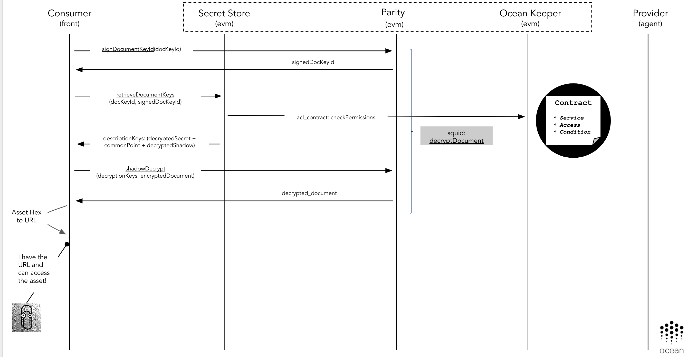

Table of Contents
=================

   * [Table of Contents](#table-of-contents)
   * [Introduction](#introduction)
   * [Architecture](#architecture)
      * [Encryption](#encryption)
      * [Decryption](#decryption)
      * [Authorization](#authorization)
   * [Deployment](#deployment)
      * [Links](#links)


---


This page describes the Parity Secret Store integration.

# Introduction

Parity Secret Store is a feature included as part of the Parity Ethereum client that allows to store on the blockchain a fragmented ECDSA key which retrievals are controlled by a permissioned Smart Contract.
The Secret Store implements a Threshold System that makes nodes unable to reconstruct the keys that allows to decrypt the documents.
It means a Secret Store node, only saves a portion of the ECDSA key. The decryption key can only be generated if a consensus is reached by an amount of Secret Store nodes bigger than the threshold that the publisher of secret chooses.


From the [Parity Secret Store documentation](https://wiki.parity.io/Secret-Store) page:

The Parity Secret Store is core technology that enables:

* distributed elliptic curve (EC) key pair generation - key is generated by several parties using special cryptographic protocol, so that:
  - private key portion remains unknown to every single party;
  - public key portion could be computed on every party and could be safely exposed to external entities;
  - every party hold the ‘share’ of the private key;
  - any subset of t+1 parties could unite to restore the private portion of the key;
  - any subset of less than t+1 parties could not restore the private portion of the key;
* distributed key storage - private key shares are stored separately by every party and are never exposed neither to another parties, nor to external entities;
* threshold retrieval according to blockchain permissions - all operations that are requiring private key, require at least t+1 parties to agree on ‘Permissioning contract’ state.


This last point can enable to Ocean Protocol to have a solid mechanism to distribute encrypted contents between parties (Consumers and Publishers),
and these contents only can be decrypted after a On-Chain authorization phase.


# Architecture


The current implementation of Ocean Protocol, detailed in the [OEP-10](https://github.com/oceanprotocol/OEPs/tree/master/10) requires to involve to the Publisher, Consumer, Provider and Smart Contracts
to build an interaction flow. This integration was difficult, needs to scale to support delegation of permissions and because the complexity is a potential source of errors.

The integration of the Secret could have the following characteristics:

* All the negotiation required to encrypt or decrypt a resource is happening without write any information on-chain
* This integration only requires standard HTTP requests between the clients (Consumer, Publisher) and the Parity EVM & Parity Secret Store API's (no gas, quick)
* Requires the usage of the Parity EVM Secret Store API existing in the Parity Ethereum clients
* Requires the usage of the Parity Secret Store API. This software is part of the Parity Ethereum client
* It's based in the usage of a permissioned Secret Store cluster. This cluster would be deployed/governed by Ocean Protocol foundation at network launch as part of the base Ocean core capabilities. Additional parties (user/companies/organizations) could be added as members allowing to decentralzied the responsibility of running this infrastructure.


## Encryption

The standard Parity Secret Store publishing flow is the following:


This logic was encapsulated as part of the [Ocean Protocol Secret Store Java Client](https://github.com/oceanprotocol/secret-store-client-java), and is abstracted as part of the `encryptDocument` Squid method.
This method allows to a Publisher to given a resource unique id and a document, to retrieve the document encrypted and store/distribute the keys used to encrypt/decrypt the document in the Secret Store cluster.
The lower level implementation is represented in the following flow:



As a result of this flow, the encrypted document can be shared with the potential Consumers (as part of the Metadata or via libp2p).

The action of Granting permissions on-chain to a specific user is not part of this flow.

## Decryption

The standard Parity Secret Store consuming flow is the following:


Again this logic is encapsulated as part of the `decryptDocument` Squid method. This method allows a to Consumer, given a resource unique id and a encrypted document (shared for the Publisher via Metadata or libp2p) to decrypt this document using the Secret Store cluster capabilities.
Decryption only can be achieved if the Secret Store cluster achieve the quorum specified by the Publisher during the publishing process with the **threshold** attribute.
The Secret Store validates on-chain the authorization permissions of the user trying to decrypt a document, not allowing to do it if those permissions are not satisfied.



## Authorization

The Consumer on-chain authorization will be implemented using the Secret Store ACL capabilities.
In the Secret Store configuration, an address of the authorization Smart Contract can be configured:
```
acl_contract = "6d6a34f2be1e76902a2fde049f317610cdf453eb"
```

Doing that, during the decryption phase, the Secret Store will call to the `checkPermissions` method of that address passing as parameter the following attributes:

* public key of the user trying to get access or decrypt
* document key id to check if user has permissions

Using this capability, a simple `checkPermissions` method could be as following:

```solidity
  // Checks if a specific user has grants to access using the acl mapping
  function checkPermissions(address user, bytes32 document) constant public returns (bool) {
    require(acl[document][user].canRead == 1, 'User was not whitelisted');
    return true;
  }
```

This could be easily adapted to use the Service Agreements approach.


# Deployment

The Secret Store functionality is provided by a Permissioned cluster that will be executed as part of the Ocean Protocol basic infrastructure.
The nodes part of this cluster only can be added changing the configuration of the members of the cluster, so a third-party malicious user can't join the cluster without changing the configuration of the other nodes.

```
[secretstore]

// Here the list of all the nodes part of the Secret Store cluster
nodes = [
  "97ca0129faba1e3d69c79bd49f186c4e0732d240fb05b2351d77f2490958d5c4396ae2f6f56f37177f3442896a590c8e73486d0cb956aa794d156cb69c88cf9d@127.0.0.1:8011",
  "2a81fad8d8a3c932a06c724bb1034850f228de8afdadabd1e13f71cedc0e58fac7814dc3f269630f2edef388906a7d7de6f6d1a2c448db03de19fa133f396db1@127.0.0.1:8012",
  "4824f1e7b73ff964a0f0026679d0ff4a88c22722bbc8ea571029b7a0e893ee68d5d299e86b70633ed5dd80c85ef7b8c11169a6a8fd4a4e914b4d10011a61b0b3@127.0.0.1:8013"
]
```

Having this into account, Ocean Protocol in order to facilitate the normal operation at the network launch will run a Secret Store cluster in different cloud locations providing good performance and high-availability in this setup.
The governance of the basic infrastructure could be shared in following phases with different organizations allowing to de-centralized the control of this infrastructure.

Having this into account, at network launch, the initial Ocean deployment could include the following basic infrastructure:

* A pool of Parity Ethereum client/nodes used to deployed the Ocean Keeper Contracts and syncronize with the Ethereum network
* A Secret Store cluster allowing to share secrets between parties
* A possible Commons Marketplace with his own Provider agent and Ocean DB instance. It would be used to demonstrate the Ocean capabilities using free/open assets


## Links

* [Parity Secret Store](https://wiki.parity.io/Secret-Store)
* [ECDKG: A Distributed Key Generation Protocol Based on Elliptic Curve Discrete Logarithm](http://citeseerx.ist.psu.edu/viewdoc/summary?doi=10.1.1.124.4128&rank=1)
* [Ocean Protocol Secret Store Java Client](https://github.com/oceanprotocol/secret-store-client-java)
* [Secret Store Proof of Concept](https://github.com/oceanprotocol/poc-secret-store)