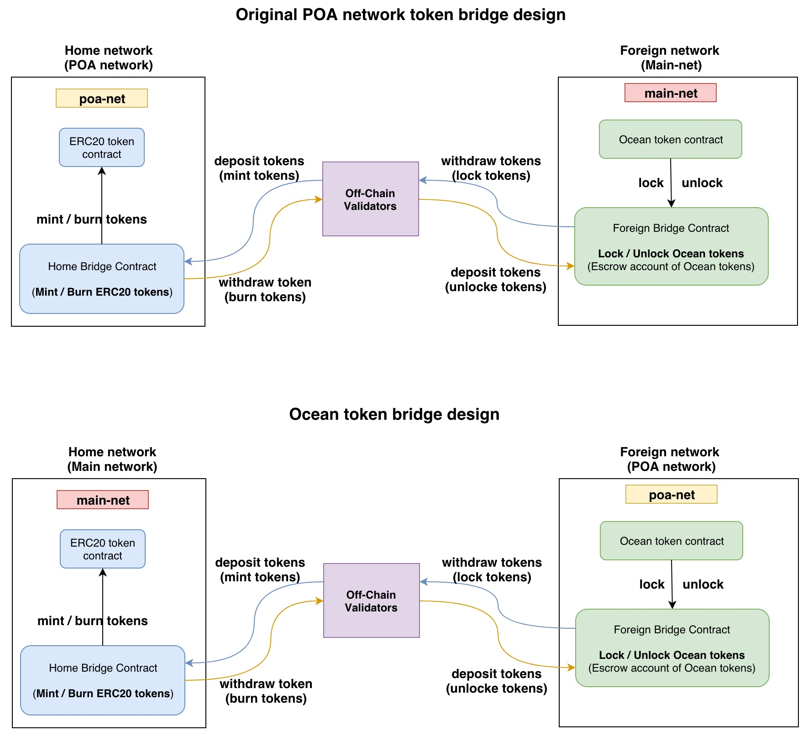
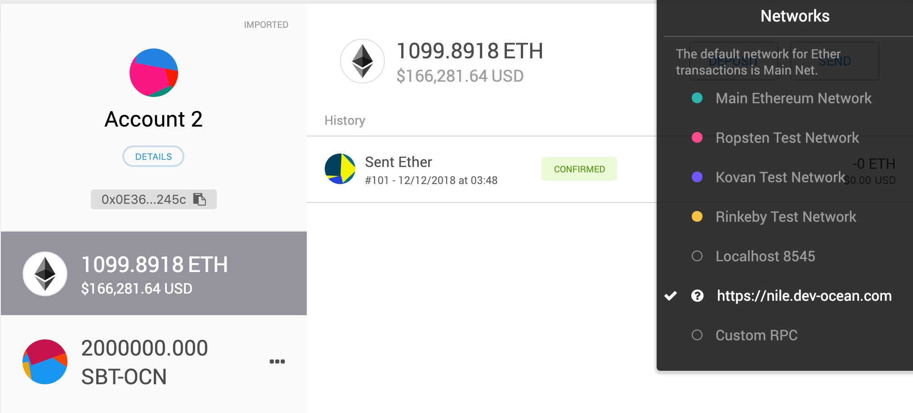
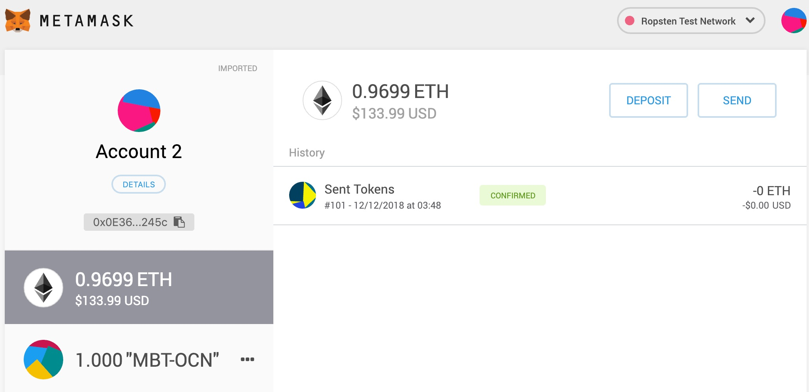
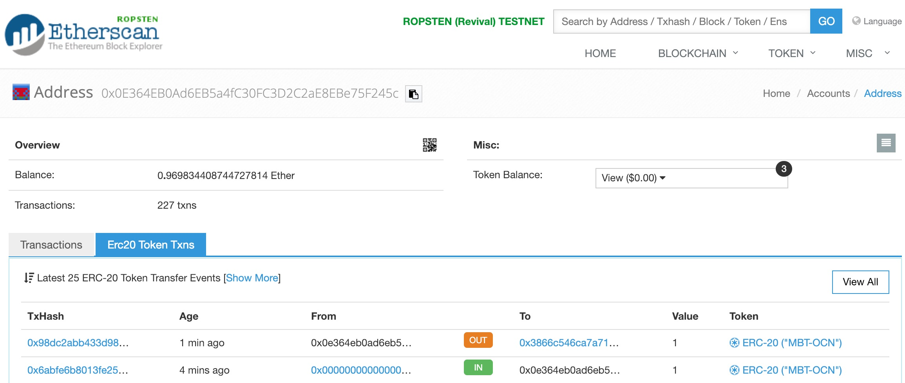

Table of Contents
=================

* [Introduction](#introduction)
* [How to deploy](#how-to-deploy)
    * [Deploy Ocean token contract to `nile` network](#deploy-ocean-token-contract-to-nile-network)
    * [Deploy token bridge contracts to both networks](#deploy-token-bridge-contracts-to-both-networks)
    * [Deploy off-chain validators](#deploy-off-chain-validators)
* [Testing token transfers](#testing-token-transfers)
* [Other resources](#other-resources)

---

## Introduction

Ocean Token Bridge is used to transfer ERC20 tokens between Ocean POA network and Ethereum mainnet. It is based on [Token Bridge developed by POA.network](https://github.com/poanetwork/token-bridge).

The overall architecture is illustrated as below:



In this way, token bridge and keeper contracts can be decoupled and each part can be developed separately, where Ocean token contract is the only contact point. 

## How to deploy

### Deploy Ocean token contract to `nile` network

To **drive the testing** of the token bridge, the Ocean token contract is needed to be deployed in `nile` network so the testing case can withdraw Ocean tokens. 

However, it is not needed in our final deployment because Ocean token contract is part of the keeper contracts and will be deployed with other smart contracts. In other words, this step can be skipped in our production deployment.

```
$ git clone git@github.com:oceanprotocol/keeper-contracts.git
$ cd keeper-contracts
```

Simply migrate Ocean token contract into our POA network `nile.dev-ocean.com`:


```
    $ npm run deploy:nile OceanToken
    
    Using network 'nile'.
    
    Loading upgrader wallet
    Loaded upgrader wallet at 0xECbfdB8571c30A692CD76042Ff2382bCc27A840F
    Loading owner wallet
    Loaded owner wallet at 0x05Fe4a49d45d1dBb5378eD4d6641a47410d96331
    Using network nile, sender address 0x711963A231C7a37DADCD82e856fcECaC32d54A37 by default.
    [ZosPackageFile] Successfully written zos.json
    [LocalController] Adding OceanToken
    [ZosPackageFile] Successfully written zos.json
    [Session] Using session with network nile, sender address 0x711963A231C7a37DADCD82e856fcECaC32d54A37
    [NetworkAppController] Validating contract OceanToken
    [NetworkAppController] Uploading OceanToken contract as OceanToken
    [SimpleProject] Deploying logic contract for OceanToken
    [ZosNetworkFile] Created zos.dev-1550056149331.json
    [Session] Using session with network nile, sender address 0x711963A231C7a37DADCD82e856fcECaC32d54A37
    [SimpleProject] Creating proxy to logic contract 0x0d4b833660e5939e6494bfd33d740858250279d9 and initializing by calling initialize with: 
     - _owner (address): "0x05Fe4a49d45d1dBb5378eD4d6641a47410d96331"
     - _initialMinter (address): "0x5A5A2E35DDBc4e8B88AF6E48EB68139e5fDBC9BD"
    [SimpleProject] Instance created at 0xf05960d5eb7203853856e5398256fb64ca2621ba
    [ZosNetworkFile] Updated zos.dev-1550056149331.json
    Renouning initialMinter as a minter from 0x5A5A2E35DDBc4e8B88AF6E48EB68139e5fDBC9BD
    Setting zos-admin to MultiSigWsllet 0xECbfdB8571c30A692CD76042Ff2382bCc27A840F
    Using session with network nile, sender address 0x711963A231C7a37DADCD82e856fcECaC32d54A37
    Proxy 0xf05960d5eb7203853856e5398256fb64ca2621ba admin changed to 0xECbfdB8571c30A692CD76042Ff2382bCc27A840F
    Updated zos.dev-nile.json
```

  
Next, switch to `https://nile.dev-ocean.com` network in MetaMask and paste token contract address: `0xf05960d5eb7203853856e5398256fb64ca2621ba` to add Ocean tokens `SBT-OCN` in Ocean POA network. 

The Ocean tokens shall look like as follows:



### Deploy token bridge contracts to both networks

Next, we need to deploy token bridge smart contracts to both networks, which includes the ERC20 token contract in Ethereum mainnet. 

First, we need to clone `poa-bridge-contracts` and create a `.env` file in the `poa-bridge-contracts/deploy` folder:

```
$ git clone git@github.com:oceanprotocol/poa-bridge-contracts.git#2.2.0
$ cd poa-bridge-contracts/deploy
$ cp .env.example .env
```

Then, adjust the parameters in the `.env` file. Example as:

Note: 

- `VALIDATORS` is the account that validate the tx and relay the message. Remember to change it to be validated account. Here I use my own account `0x0E364EB0Ad6EB5a4fC30FC3D2C2aE8EBe75F245c` for testing.
- `ERC20_TOKEN_ADDRESS` is the deployed ERC20 contract address from last step.


```
	BRIDGE_MODE=ERC_TO_ERC
	
	DEPLOYMENT_ACCOUNT_PRIVATE_KEY=4F43...<private key>
	DEPLOYMENT_GAS_LIMIT=4000000
	HOME_DEPLOYMENT_GAS_PRICE=10000000000
	FOREIGN_DEPLOYMENT_GAS_PRICE=10000000000
	GET_RECEIPT_INTERVAL_IN_MILLISECONDS=3000
	
	BRIDGEABLE_TOKEN_NAME="MainBridgeOceanToken"
	BRIDGEABLE_TOKEN_SYMBOL="MBT-OCN"
	BRIDGEABLE_TOKEN_DECIMALS=18
	
	HOME_RPC_URL=https://ropsten.infura.io/Kuo1lxDBsFtMnaw6GiN2
	HOME_OWNER_MULTISIG=0x0E364EB0Ad6EB5a4fC30FC3D2C2aE8EBe75F245c
	HOME_UPGRADEABLE_ADMIN_VALIDATORS=0x0E364EB0Ad6EB5a4fC30FC3D2C2aE8EBe75F245c
	HOME_UPGRADEABLE_ADMIN_BRIDGE=0x0E364EB0Ad6EB5a4fC30FC3D2C2aE8EBe75F245c
	HOME_DAILY_LIMIT=15000000000000000000000000
	HOME_MAX_AMOUNT_PER_TX=750000000000000000000000
	HOME_MIN_AMOUNT_PER_TX=500000000000000000
	HOME_REQUIRED_BLOCK_CONFIRMATIONS=8
	HOME_GAS_PRICE=10000000000
	
	
	FOREIGN_RPC_URL=https://nile.dev-ocean.com
	FOREIGN_OWNER_MULTISIG=0x0E364EB0Ad6EB5a4fC30FC3D2C2aE8EBe75F245c
	FOREIGN_UPGRADEABLE_ADMIN_VALIDATORS=0x0E364EB0Ad6EB5a4fC30FC3D2C2aE8EBe75F245c
	FOREIGN_UPGRADEABLE_ADMIN_BRIDGE=0x0E364EB0Ad6EB5a4fC30FC3D2C2aE8EBe75F245c
	FOREIGN_DAILY_LIMIT=30000000000000000000000000
	FOREIGN_MAX_AMOUNT_PER_TX=1500000000000000000000000
	FOREIGN_MIN_AMOUNT_PER_TX=500000000000000000
	FOREIGN_REQUIRED_BLOCK_CONFIRMATIONS=1
	FOREIGN_GAS_PRICE=1000000000
	#for bridge erc_to_erc mode
	ERC20_TOKEN_ADDRESS=0x6964158c92B149a9c0C65fCA2362040c93425a66
	
	REQUIRED_NUMBER_OF_VALIDATORS=1
	VALIDATORS=0x0E364EB0Ad6EB5a4fC30FC3D2C2aE8EBe75F245c
```

Next, build the bridge contract and deploy it to both networks:

```
$ cd poa-bridge-contracts
$ docker-compose run bridge-contracts deploy.sh
```

The output looks like below:
	
```
	$ docker-compose run bridge-contracts deploy.sh
	Creating network "2poa-bridge-contracts_default" with the default driver
	Building bridge-contracts
	Step 1/12 : FROM node:8
	 ---> 3b7ecd51ffe5
	Step 2/12 : WORKDIR /contracts
	 ---> Using cache
	 ---> 59ed7cabf7a9
	Step 3/12 : COPY package.json .
	 ---> Using cache
	 ---> 44dac952630e
	Step 4/12 : COPY package-lock.json .
	 ---> Using cache
	 ---> 17627de026e3
	Step 5/12 : RUN npm install
	 ---> Using cache
	 ---> 3d3829861bf3
	Step 6/12 : COPY ./deploy/package.json ./deploy/
	 ---> Using cache
	 ---> bb473596ccb1
	Step 7/12 : COPY ./deploy/package-lock.json ./deploy/
	 ---> Using cache
	 ---> 9c5dcd40d9e2
	Step 8/12 : RUN cd ./deploy; npm install; cd ..
	 ---> Using cache
	 ---> 3a550db2ab25
	Step 9/12 : COPY . .
	 ---> 271e2c3c7dcc
	Step 10/12 : RUN npm run compile
	 ---> Running in 3acd5bb9bc69
	
	> poa-parity-bridge-contracts@1.0.0 compile /contracts
	> truffle compile
	
	Compiling ./contracts/ERC677.sol...
	Compiling ./contracts/ERC677BridgeToken.sol...
	Compiling ./contracts/ERC677Receiver.sol...
	Compiling ./contracts/IBlockReward.sol...
	Compiling ./contracts/IBridgeValidators.sol...
	Compiling ./contracts/IBurnableMintableERC677Token.sol...
	Compiling ./contracts/Migrations.sol...
	Compiling ./contracts/libraries/Message.sol...
	Compiling ./contracts/libraries/SafeMath.sol...
	Compiling ./contracts/test/BlockReward.sol...
	Compiling ./contracts/upgradeability/EternalStorage.sol...
	Compiling ./contracts/upgradeability/EternalStorageProxy.sol...
	Compiling ./contracts/upgradeability/OwnedUpgradeabilityProxy.sol...
	Compiling ./contracts/upgradeability/Proxy.sol...
	Compiling ./contracts/upgradeability/UpgradeabilityOwnerStorage.sol...
	Compiling ./contracts/upgradeability/UpgradeabilityProxy.sol...
	Compiling ./contracts/upgradeability/UpgradeabilityStorage.sol...
	Compiling ./contracts/upgradeable_contracts/BasicBridge.sol...
	Compiling ./contracts/upgradeable_contracts/BasicForeignBridge.sol...
	Compiling ./contracts/upgradeable_contracts/BasicHomeBridge.sol...
	Compiling ./contracts/upgradeable_contracts/BridgeValidators.sol...
	Compiling ./contracts/upgradeable_contracts/ERC677Bridge.sol...
	Compiling ./contracts/upgradeable_contracts/Ownable.sol...
	Compiling ./contracts/upgradeable_contracts/Validatable.sol...
	Compiling ./contracts/upgradeable_contracts/erc20_to_erc20/ForeignBridgeErcToErc.sol...
	Compiling ./contracts/upgradeable_contracts/erc20_to_erc20/HomeBridgeErcToErc.sol...
	Compiling ./contracts/upgradeable_contracts/erc20_to_native/ForeignBridgeErcToNative.sol...
	Compiling ./contracts/upgradeable_contracts/erc20_to_native/HomeBridgeErcToNative.sol...
	Compiling ./contracts/upgradeable_contracts/native_to_erc20/ForeignBridgeNativeToErc.sol...
	Compiling ./contracts/upgradeable_contracts/native_to_erc20/HomeBridgeNativeToErc.sol...
	Compiling openzeppelin-solidity/contracts/math/SafeMath.sol...
	Compiling openzeppelin-solidity/contracts/ownership/Ownable.sol...
	Compiling openzeppelin-solidity/contracts/token/ERC20/BasicToken.sol...
	Compiling openzeppelin-solidity/contracts/token/ERC20/BurnableToken.sol...
	Compiling openzeppelin-solidity/contracts/token/ERC20/DetailedERC20.sol...
	Compiling openzeppelin-solidity/contracts/token/ERC20/ERC20.sol...
	Compiling openzeppelin-solidity/contracts/token/ERC20/ERC20Basic.sol...
	Compiling openzeppelin-solidity/contracts/token/ERC20/MintableToken.sol...
	Compiling openzeppelin-solidity/contracts/token/ERC20/StandardToken.sol...
	
	Compilation warnings encountered:
	
	/contracts/contracts/IBlockReward.sol:6:5: Warning: Functions in interfaces should be declared external.
	    function mintedTotally() public view returns (uint256);
	    ^-----------------------------------------------------^
	,/contracts/contracts/IBlockReward.sol:7:5: Warning: Functions in interfaces should be declared external.
	    function mintedTotallyByBridge(address _bridge) public view returns(uint256);
	    ^---------------------------------------------------------------------------^
	,/contracts/contracts/IBridgeValidators.sol:5:5: Warning: Functions in interfaces should be declared external.
	    function isValidator(address _validator) public view returns(bool);
	    ^-----------------------------------------------------------------^
	,/contracts/contracts/IBridgeValidators.sol:6:5: Warning: Functions in interfaces should be declared external.
	    function requiredSignatures() public view returns(uint256);
	    ^---------------------------------------------------------^
	,/contracts/contracts/IBridgeValidators.sol:7:5: Warning: Functions in interfaces should be declared external.
	    function owner() public view returns(address);
	    ^--------------------------------------------^
	,/contracts/contracts/upgradeable_contracts/BasicForeignBridge.sol:27:5: Warning: Function state mutability can be restricted to pure
	    function onExecuteMessage(address, uint256) internal returns(bool){
	    ^ (Relevant source part starts here and spans across multiple lines).
	,/contracts/contracts/upgradeable_contracts/BasicHomeBridge.sol:80:5: Warning: Function state mutability can be restricted to pure
	    function onExecuteAffirmation(address, uint256) internal returns(bool) {
	    ^ (Relevant source part starts here and spans across multiple lines).
	,/contracts/contracts/upgradeable_contracts/ERC677Bridge.sol:26:5: Warning: Function state mutability can be restricted to pure
	    function fireEventOnTokenTransfer(address /*_from */, uint256 /* _value */) internal {
	    ^ (Relevant source part starts here and spans across multiple lines).
	
	Writing artifacts to ./build/contracts
	
	Removing intermediate container 3acd5bb9bc69
	 ---> dcfc97900bdb
	Step 11/12 : RUN bash flatten.sh
	 ---> Running in f4e6e3b06af9
	Removing intermediate container f4e6e3b06af9
	 ---> a816fe0d4fa2
	Step 12/12 : ENV PATH="/contracts/:${PATH}"
	 ---> Running in aa9867393245
	Removing intermediate container aa9867393245
	 ---> ea1ce4c2da4a
	
	Successfully built ea1ce4c2da4a
	Successfully tagged poa-bridge-contracts_bridge-contracts:latest
	=====================================
	
	Bridge contract deployment started
	Bridge mode: ERC_TO_ERC
	deploying storage for home validators
	pending txHash 0xcc39a2a68cb205cea3f7bdcd9a923bb78d3f7af13334bf5cdc2f432d24c537fd
	[Home] BridgeValidators Storage:  0x13A803588eB258157956b9dbCAA95F05e200Cc92
	
	deploying implementation for home validators
	pending txHash 0xac27b1264e5cbceb40fb47ccfbed9606a0d2409cc3c0d9c207c33378a3c85e1f
	[Home] BridgeValidators Implementation:  0x105879254377451a56Db50F03DeB4DC5208d1d25
	
	hooking up eternal storage to BridgeValidators
	pending txHash 0x2b0189348efd2ba9d55758a4f6feff93ede733057595516e8a3b88fc5be082bf
	
	initializing Home Bridge Validators with following parameters:
	
	REQUIRED_NUMBER_OF_VALIDATORS: 1, VALIDATORS: 0x0E364EB0Ad6EB5a4fC30FC3D2C2aE8EBe75F245c
	pending txHash 0xb31c656b195a2a6b16783cb8b9ca76a9d89158f072e69df13bedd8f4c6819430
	
	deploying homeBridge storage
	
	pending txHash 0xd242a8da69ee9cdaf909421e9fea4e8df4e6938cab17eed85c09482ee56b3e03
	[Home] HomeBridge Storage:  0x3866C546ca7A710cd13Ec589F73e364074BBe5E0
	
	deploying homeBridge implementation
	
	pending txHash 0x6e54e12f5ce4f876cdfd86c4723790498f2e8e1d1995181a5ef5dd506ed08adf
	[Home] HomeBridge Implementation:  0xC2BE5985BBC0cF1229cf6C08c7d3dB8638eaC808
	
	hooking up HomeBridge storage to HomeBridge implementation
	pending txHash 0xe45a46d95165e1d2743b560b3abafc6f01b82b9998e1e9d839838f44d66b100a
	
	[Home] deploying Bridgeble token
	pending txHash 0xd58dc45009a203a1297e2e8aa354886130e681ca1ade6b1cdad51da811083145
	[Home] Bridgeble Token:  0x838A05e44105f7b7Ab9FB03Fb90A1fa9C7fD07b1
	
	set bridge contract on ERC677BridgeToken
	pending txHash 0x211951bf3533fcc8981b11c4af3596f13b1503b91825b5ad80249892f4812bc9
	transferring ownership of Bridgeble token to homeBridge contract
	pending txHash 0xb728375f4fe7594e9bb868107187ea6ff4df695281af44fe2cc3afa21ed37cfe
	
	initializing Home Bridge with following parameters:
	
	Home Validators: 0x13A803588eB258157956b9dbCAA95F05e200Cc92,
	  HOME_DAILY_LIMIT : 15000000000000000000000000 which is 15000000 in eth,
	  HOME_MAX_AMOUNT_PER_TX: 750000000000000000000000 which is 750000 in eth,
	  HOME_MIN_AMOUNT_PER_TX: 500000000000000000 which is 0.5 in eth,
	  HOME_GAS_PRICE: 10000000000, HOME_REQUIRED_BLOCK_CONFIRMATIONS : 8
	  
	pending txHash 0x2d52d5f339cf3ca143e30ba74a4507310c2485d6ff366f54d24b5c0f47e4dd40
	
	Home Deployment Bridge completed
	
	========================================
	deploying ForeignBridge
	========================================
	
	deploying storage for foreign validators
	pending txHash 0x740cf8dd3d509be658f300ff4fc6145d608b74aa53456a879c8ae2856d5c30e9
	[Foreign] BridgeValidators Storage:  0x4C68adD715C37c3Ea1f7132D5a255673df0D4d83
	
	deploying implementation for foreign validators
	pending txHash 0x6f13aa89f02f5970b2c361a7c25d39816f870127dcf0d54f44cb54f7a209f161
	[Foreign] BridgeValidators Implementation:  0x554FC748B2AFb244Bf2Db02115b73b476c89A72d
	
	hooking up eternal storage to BridgeValidators
	pending txHash 0x63ec19c8e408e8324e9dc6d603a1a8e8f8bb906806043444e6d89cda0edfeaf3
	
	initializing Foreign Bridge Validators with following parameters:
	
	REQUIRED_NUMBER_OF_VALIDATORS: 1, VALIDATORS: 0x0E364EB0Ad6EB5a4fC30FC3D2C2aE8EBe75F245c
	pending txHash 0x59bca66e41a98a32fbd55f47dfe1c672cfe8785a3da2bcd0120da35e78bce309
	
	Transferring ownership of ValidatorsProxy
	
	pending txHash 0x2261a6684d8eaec11e2b10fad6de4a754bc68ca6b3ee486402bc2b68095de935
	
	deploying foreignBridge storage
	
	pending txHash 0x2ee16ff76edcadf0ecbbfe05d2be58b04b842e15bf4f14d48f2cea98b8b05d05
	[Foreign] ForeignBridge Storage:  0x8A15E11ec9954E73d737Eea45b432fD1bDABA689
	
	deploying foreignBridge implementation
	
	pending txHash 0x66ea8f55484078ed2ad43e0187e195a9c7e375d824a3676e81a7baadadad2878
	[Foreign] ForeignBridge Implementation:  0x2dC2cADA21190b7DBcb06B2aF72773e2c1e434C8
	
	hooking up ForeignBridge storage to ForeignBridge implementation
	pending txHash 0xc362675a7bf755b14b34c40f1a523c2cc05b4705de58876f1686e89ef23bfcb9
	
	initializing Foreign Bridge with following parameters:
	
	Foreign Validators: 0x4C68adD715C37c3Ea1f7132D5a255673df0D4d83,
	  
	pending txHash 0x62376c249a4895af16ff991ea53040b9ce62abb661d7f0d4d755f39e0f47050e
	pending txHash 0x12a847f97c833582d58d67d941d96467ddadb3881da3491b399d099a7d559456
	
	Foreign Deployment Bridge completed
	
	
	Deployment has been completed.
	
	
	[   Home  ] HomeBridge: 0x3866C546ca7A710cd13Ec589F73e364074BBe5E0 at block 4724891
	[   Home  ] ERC677 Bridgeable Token: 0x838A05e44105f7b7Ab9FB03Fb90A1fa9C7fD07b1
	[ Foreign ] ForeignBridge: 0x8A15E11ec9954E73d737Eea45b432fD1bDABA689 at block 61349
	[ Foreign ] ERC20 Token: 0x6964158c92B149a9c0C65fCA2362040c93425a66
	Contracts Deployment have been saved to `bridgeDeploymentResults.json`
	{
	    "homeBridge": {
	        "address": "0x3866C546ca7A710cd13Ec589F73e364074BBe5E0",
	        "deployedBlockNumber": 4724891,
	        "erc677": {
	            "address": "0x838A05e44105f7b7Ab9FB03Fb90A1fa9C7fD07b1"
	        }
	    },
	    "foreignBridge": {
	        "address": "0x8A15E11ec9954E73d737Eea45b432fD1bDABA689",
	        "deployedBlockNumber": 61349
	    }
	}
```

### Deploy off-chain validators

At this time, all on-chain components are deployed and ready to be used. We need to deploy the off-chain component, which relay the tx message across networks.

First, clone `token-bridge` and edit `.env` file:

```
$ git clone git@github.com:oceanprotocol/token-bridge.git#1.1.0
$ cd token-bridge
$ cp .env.example .env
```

The `.env` file should be edited as following:

Note: 

* important to update there address: `HOME_BRIDGE_ADDRESS`, `FOREIGN_BRIDGE_ADDRESS` and `ERC20_TOKEN_ADDRESS`, which can be copied from output in last step.
* "MAX_PROCESSING_TIME=200000" shall be extended if there is an error of "MAX PROCESSING TIME".
* The functionality when the same account is used to send tokens and to be the bridge validator is not supported. Therefore, **please use different accounts for token transfers and bridge validators**.

```
	BRIDGE_MODE=ERC_TO_ERC
	HOME_POLLING_INTERVAL=5000
	FOREIGN_POLLING_INTERVAL=1000
	ALLOW_HTTP=no
	HOME_RPC_URL=https://ropsten.infura.io/Kuo1lxDBsFtMnaw6GiN2
	FOREIGN_RPC_URL=https://nile.dev-ocean.com
	HOME_BRIDGE_ADDRESS=0x3866C546ca7A710cd13Ec589F73e364074BBe5E0
	FOREIGN_BRIDGE_ADDRESS=0x8A15E11ec9954E73d737Eea45b432fD1bDABA689
	ERC20_TOKEN_ADDRESS=0x6964158c92B149a9c0C65fCA2362040c93425a66
	
	VALIDATOR_ADDRESS=0x0E364EB0Ad6EB5a4fC30FC3D2C2aE8EBe75F245c
	VALIDATOR_ADDRESS_PRIVATE_KEY=4F43...<private key>
	
	
	QUEUE_URL=amqp://127.0.0.1
	REDIS_URL=redis://127.0.0.1:6379
	REDIS_LOCK_TTL=1000
	
	HOME_START_BLOCK=
	FOREIGN_START_BLOCK=
	
	LOG_LEVEL=debug
	MAX_PROCESSING_TIME=200000
	
	#testing accs
	USER_ADDRESS=0xf9e6BFc60Bb6Ae652671Bb7B9b8A65A289Bd113E
	USER_ADDRESS_PRIVATE_KEY=4F43...<private key>
	HOME_MIN_AMOUNT_PER_TX=1
	FOREIGN_MIN_AMOUNT_PER_TX=1
	HOME_TEST_TX_GAS_PRICE=1000000000
	FOREIGN_TEST_TX_GAS_PRICE=1000000000
```

Then, we can build and start the docker images as:

```
	$ docker-compose up -d --build
	Building bridge
	Step 1/13 : FROM node:8
	 ---> 3b7ecd51ffe5
	Step 2/13 : RUN apt-get update
	 ---> Using cache
	 ---> 5aa584203bd2
	Step 3/13 : RUN apt-get install -y build-essential
	 ---> Using cache
	 ---> 2fd24d4e82ed
	Step 4/13 : RUN apt-get install -y libc6-dev
	 ---> Using cache
	 ---> 7e3f532e9405
	Step 5/13 : RUN apt-get install -y libc6-dev-i386
	 ---> Using cache
	 ---> 8c47b88b2524
	Step 6/13 : RUN apt-get install -y wget
	 ---> Using cache
	 ---> 3623cf27b72b
	Step 7/13 : RUN apt-get clean
	 ---> Using cache
	 ---> f6d76709e352
	Step 8/13 : WORKDIR /bridge
	 ---> Using cache
	 ---> b1618ec5d6d7
	Step 9/13 : COPY package.json .
	 ---> Using cache
	 ---> 94eb99120ebe
	Step 10/13 : COPY package-lock.json .
	 ---> Using cache
	 ---> eb1d9a7584f7
	Step 11/13 : RUN npm install
	 ---> Using cache
	 ---> 5dd597aa695f
	Step 12/13 : COPY . .
	 ---> 9e0bccaa171d
	Step 13/13 : CMD echo "To start a bridge process run:"   "docker-compose run bridge npm run watcher:signature-request"   "docker-compose run bridge npm run watcher:collected-signatures"   "docker-compose run bridge npm run watcher:affirmation-request"   "docker-compose run bridge npm run sender:home"   "docker-compose run bridge npm run sender:foreign"
	 ---> Running in 8a6f6e11daa5
	Removing intermediate container 8a6f6e11daa5
	 ---> 9d1dd486d172
	Successfully built 9d1dd486d172
	Successfully tagged token-bridge_bridge:latest
	Creating token-bridge_redis_1  ... done
	Creating token-bridge_rabbit_1 ... done
	Creating token-bridge_bridge_1 ... done
```

Lastly, start modules in off-chain token bridge as following:

**each command shall be launched in a separate terminal**

- Start RabbitMQ and Redis: if you are running the bridge containers for the first time use `docker-compose up -d --build` otherwise use `docker-compose up -d`
- `docker-compose run bridge npm run watcher:signature-request`
- `docker-compose run bridge npm run watcher:collected-signatures`
- `docker-compose run bridge npm run watcher:affirmation-request`
- `docker-compose run bridge npm run sender:home`
- `docker-compose run bridge npm run sender:foreign`

## Testing token transfers

To run test, first install the needed package:

```
npm install dotenv
```

Then, run the testing script as follows:

```
// transfer tokens from POA network to Ropsten testnet
$node scripts/erc20_to_erc20/sendForeign.js 1
1 ' # ' '0x61ee80130b549d027c4f2d0a8351308ebd84f42ac960b59c3d26ac6235956ba9'

// transfer tokens from Ropsten testnet back to POA network
$ node scripts/erc20_to_erc20/sendHome.js 1
1 ' # ' '0x98dc2abb433d98559648276c7d3cc9a6ee41db7f2f256e0322445f8ee6f126c1'
```

We successfully move 1 Ocean token from POA network into Ropsten network (shown as below). After, we move this token back to POA network.



Both transactions can be verified on Ropsten network:



## Other resources

**Bridge Elements**:

- [Bridge UI](https://github.com/poanetwork/bridge-ui). A DApp interface to transfer tokens and coins between chains.
- [Bridge Monitor](https://github.com/poanetwork/bridge-monitor). A tool for checking balances and unprocessed events in bridged networks.
