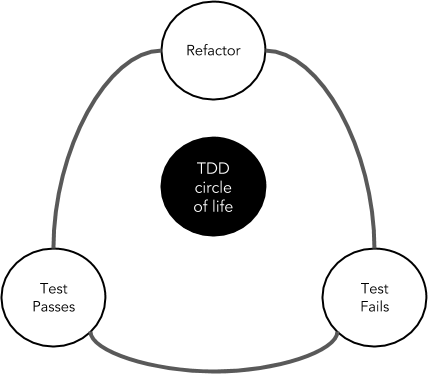
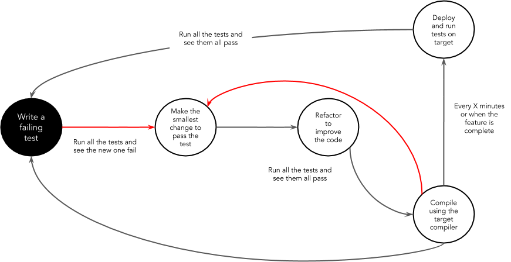

Table of Contents
=================

   * [Test Driven Development](#test-driven-development)
      * [Benefits](#benefits)
      * [Recommended Steps](#recommended-steps)

---

# Test Driven Development

Test-driven development **(TDD)** refers to a style of programming in which
three activities are tightly related: coding, testing (in the form of writing
unit tests) and design (in the form of refactoring).

It can be succinctly described by the following set of rules:

1. Write a single unit test describing an aspect of the program
1. Run the test, which should fail because the program lacks that feature
1. Build the simplest code possible to make the test pass
1. Refactor the code until it conforms to the simplicity criteria
1. Repeat, accumulating unit tests over time

In the below image you can see the typical workflow of the TDD approach:

## Benefits

The main benefits of TDD are:

* More quality - Many teams report significant reductions in defect rates, at the cost of a moderate increase in initial development effort.
* Shorten development times - The investment of time in TDD helps to have a more focused development phase where applications are developed implementing only the requirements requested
* Easier to maintain - More testable applications means applications easier to maintain
* Reduce costs - More robust applications means less time spend in bug fixing, it can reduces the development costs of the applications
* More focused in business requirements - More robust applications means less time spend in bug fixing, so the delivery team can focus to implement business value
* Working as expected - The tests definition works as a contract between the business requirement and the code implementation. Focusing in tests definition and implementation helps to be more aligned with the results expected by the business
* Quicker feedback - Having tests validating the applications executed frequently allows to detect quickly any problem and react to them

## Recommended Steps

Follow these steps (slight variations exist among TDD practitioners):

* Understand the requirements of the issue that you are working on
* **Red**: Create a test and make it fail.
  - Imagine how the new code should be called and write the test as if the code already existed.
  - Write just enough code so that it compiles.
  - Run the test. It should fail. This is a calibration measure to ensure that your test is calling the correct code and that the code is not working by accident. This is a meaningful failure, and you expect it to fail.
* **Green**: Make the test pass by any means necessary.
  - Write the production code to make the test pass. Keep it simple.
  - Some advocate the hard-coding of the expected return value first to verify that the test correctly detects success. This varies from practitioner to practitioner.
  - If you've written the code so that the test passes as intended, you are finished. You do not have to write more code speculatively. The test is the objective definition of "done." The phrase "You Ain't Gonna Need It" (YAGNI) is often used to veto unnecessary work. If new functionality is still needed, then another test is needed. Make this one test pass and continue.
  - When the test passes, you might want to run all tests up to this point to build confidence that everything else is still working.
* **Refactor** : Change the code to remove duplication in your project and to improve the design while ensuring that all tests still pass.
  - Remove duplication caused by the addition of the new functionality.
  - Make design changes to improve the overall solution.
  - After each refactoring, rerun all the tests to ensure that they all still pass.
* **Repeat the cycle**. Each cycle should be very short, and a typical hour should contain many Red/Green/Refactor cycles.

