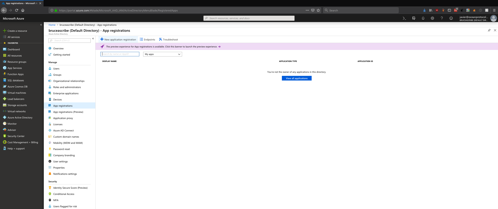
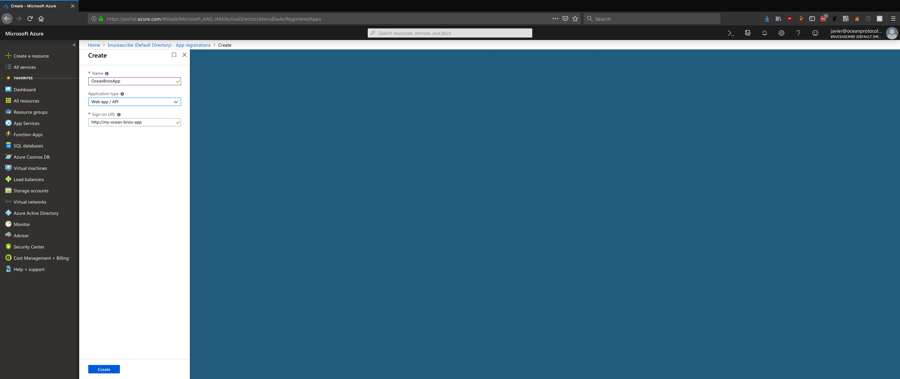
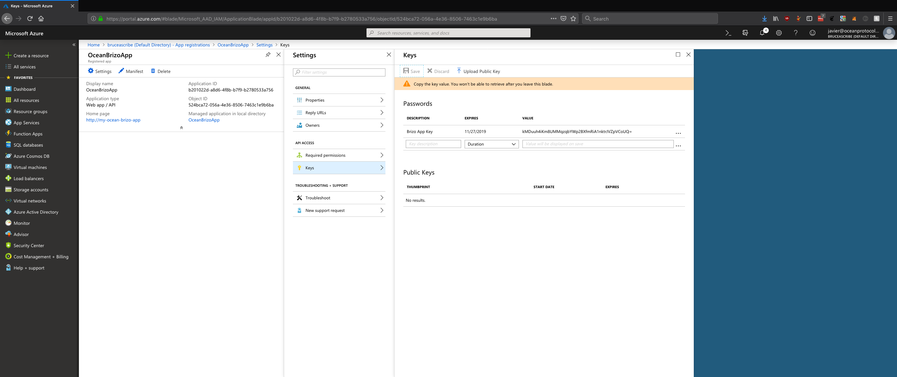
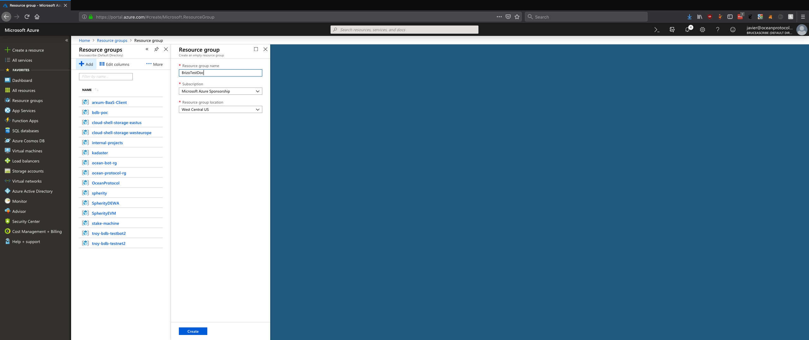
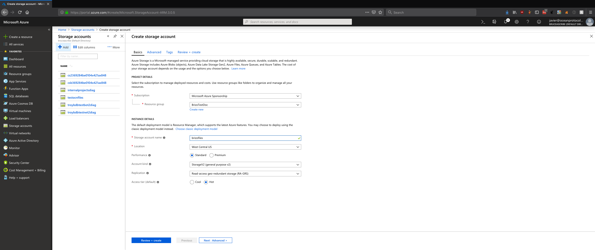
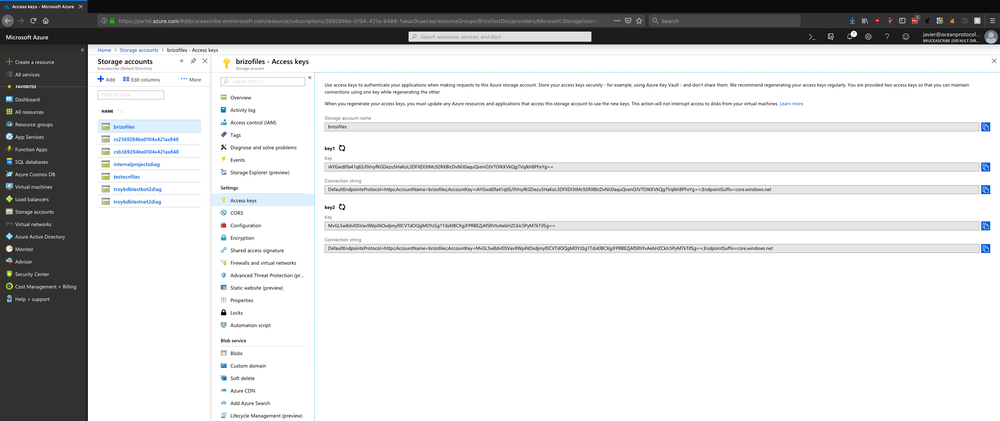
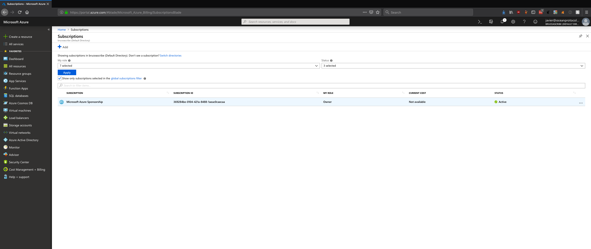
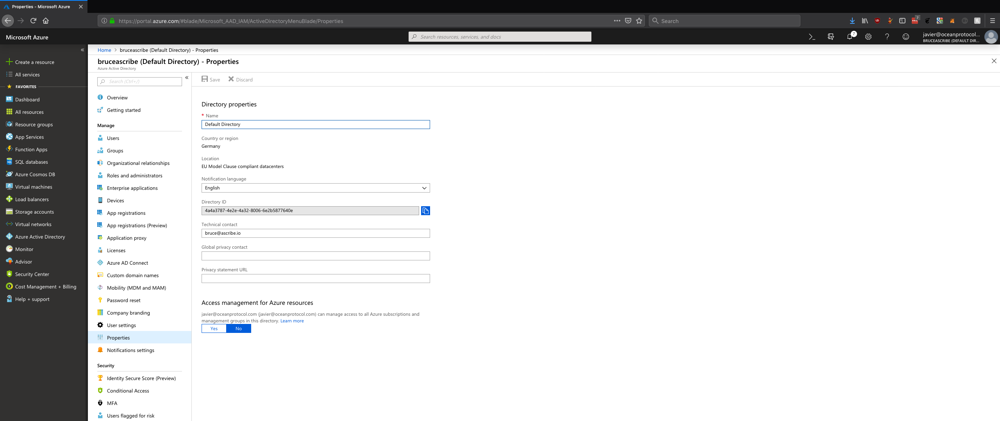

# Create Azure Credentials for Brizo

## Table of Contents

  - [Create a new Application](#create-a-new-application)
  - [Create a Resource Group and giving access to the Application](#create-a-resource-group-and-giving-access-to-the-application)
  - [Create a Storage Account](#create-a-storage-account)
  - [Get Subscription ID and Tenant ID](#get-subscription-id-and-tenant-id)

---

## Create a new Application

Navigate to `Azure Active Directory`, then to `App registrations`, and there click on `New Application registration`:

Then complete the `Name` and `Sign-on URL` (it does not need to be a real URL):

Once created the new Application, take from there the `Application ID` (used for variable `AZURE_CLIENT_ID`):

Then click on `Settings`, and click again on `Keys`. Write a `Description` and the desire `Expires` time for the key, and click on `Save`. Copy the `Value` generated (used for value `AZURE_CLIENT_SECRET`):

## Create a Resource Group and giving access to the Application

Navigate to `Resource Groups` in Azure. There, click on `Add`:

Write there a name (used for variable `AZURE_RESOURCE_GROUP`) and choose a region (used for `AZURE_LOCATION` as codename). Once created, click on `Access control (IAM)` and then to `Add`. Select the `Role` (`Contributor`) and search for the application recently created, select it, and click on `Save`:

## Create a Storage Account

Navigate to `Storage accounts` in Azure. There, click on `Add`. Select the `Resource Group`, a `Storage account name` (used for variable `AZURE_ACCOUNT_NAME` and the same `Location`):

Once created, click on it (under `Storage accounts`) and there on `Access keys`. Use one of those keys as variable `AZURE_ACCOUNT_KEY`.

## Get Subscription ID and Tenant ID

Navigate to `Subscriptions` in Azure. There copy the `Subscription ID` (used for variable `AZURE_SUBSCRIPTION_ID`):

To get the `Tenant ID`, navigate to `Azure Active Directory`, then to `Properties`, and copy there the `Directory ID` (used for `AZURE_TENANT_ID`):

