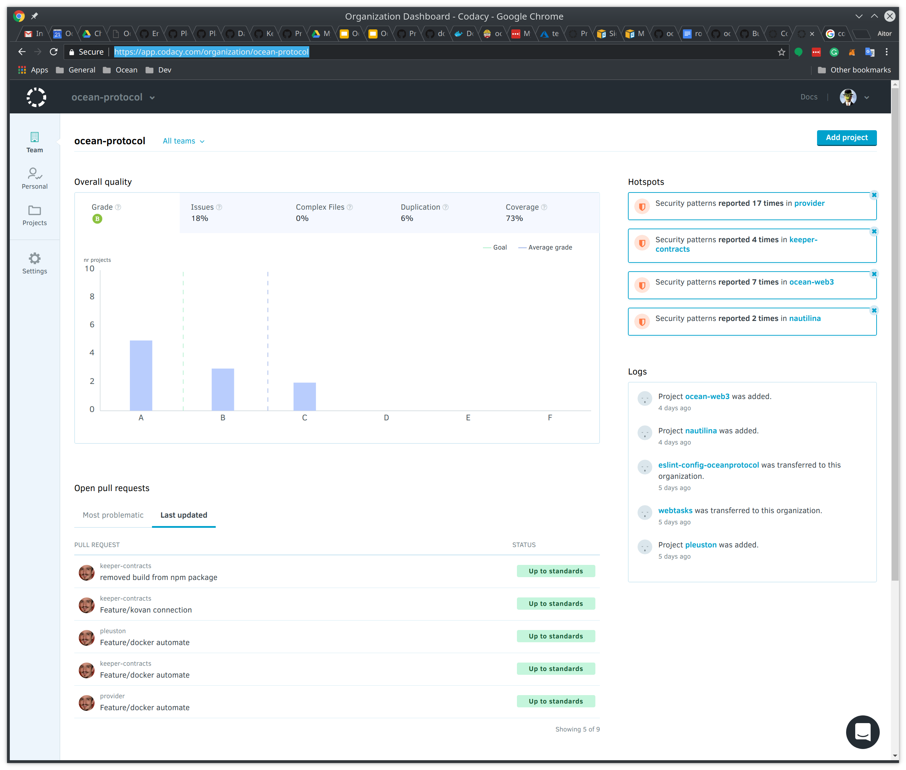
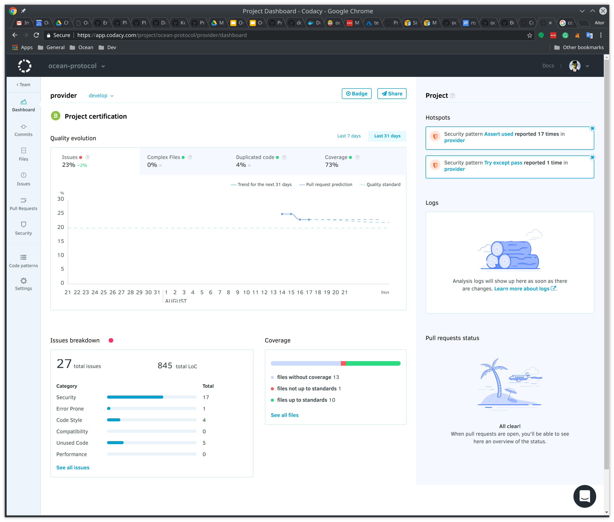
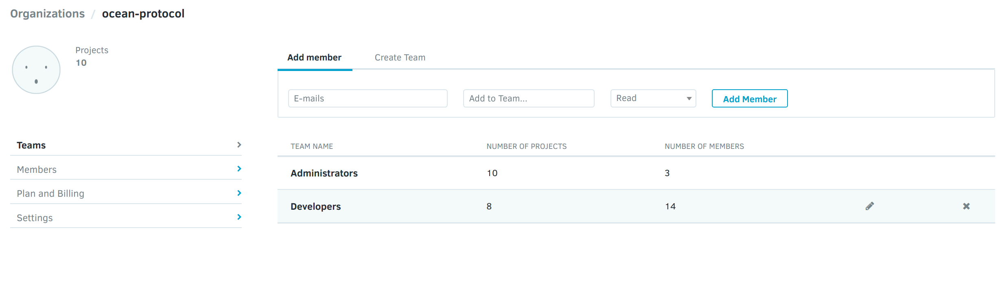
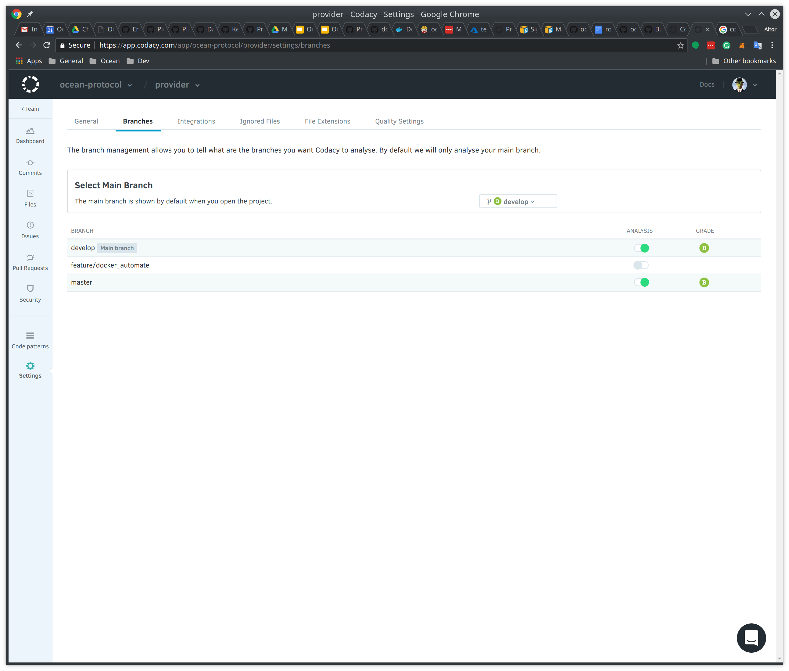
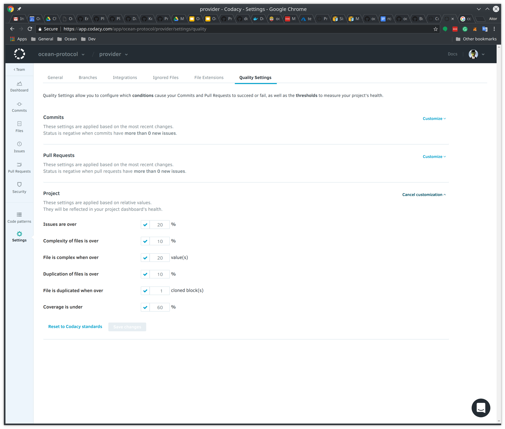

# Codacy code analysis tool

Codacy automates code reviews and monitors code quality over time. Static analysis, code coverage and metrics for
Ruby, JavaScript, PHP, Scala, Java, Python.

Codacy is configured as part of the Continuous Integration stack, as in in charge of analyze the code quality
in **develop** and **master** branches of most relevant Ocean Protocol projects.

The url to get access to the codacy Ocean Protocol organization is:
https://app.codacy.com/organization/ocean-protocol

The main documentation page can be found in the following link:
https://support.codacy.com/hc/en-us

## Dashboard

Codacy provides a dashboard per project where is possible to see at a glance the status of the main quality project indicators:

* Number of issues found and issues breakdown
* Number of complex files
* Duplicated code
* Code coverage, percentage of lines of code tested
* Pull requests status

## Codacy Setup

In order to have an homogeneous Codacy setup, it is necessary to configure all the development projects using the following setup:

### Collaborators & teams

In Codacy are configured two different kind of users:

* [Developers](https://app.codacy.com/organizations/ocean-protocol/Developers/projects) team with **Read** grants in all the code reports
* [Administrators](https://app.codacy.com/organizations/ocean-protocol/Administrators/projects) team with **Admin** grants

The **Administrators** team is able to modify the common settings of all the projects.

### Branches

Codacy should be setup in all the projects to analyze **develop** and **master** branches. Develop branch should be configured as main branch for analysis.

### Quality Settings

Codacy should include a minimal quality thresholds in settings, allowing to block compilations in Github if new commits don't fit the quality expectations.
By default, each project should have configured the following values:

* Issues are over **20%**
* Complexity of files is over **10%**
* File is complex when over **20 value(s)**
* Duplication of files is over 10%**
* File is duplicated when over **1 cloned block(s)**
* Coverage is under **60%**

### Code coverage

To have in the project valid metrics about code coverage, each project depending of the development language should apply some configurations to expose the code coverage reports to codacy.
You can find further information about how to do it in the following links:

* Settings page of each project: https://app.codacy.com/app/ocean-protocol/keeper-contracts/settings/coverage
* Support page: https://support.codacy.com/hc/en-us/articles/207279819-Coverage

