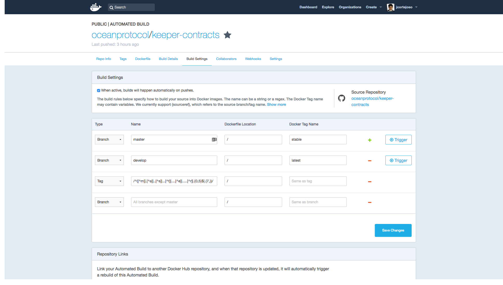

# Docker images generated with CI

## Table of Contents

  - [Docker Hub vs. Docker Cloud](#docker-hub-vs-docker-cloud)
  - [Docker images generated](#docker-images-generated)
  - [Docker Hub Setup](#docker-hub-setup)
     - [Creating or configuring a new Automated Image](#creating-or-configuring-a-new-automated-image)
     - [Collaborators &amp; teams](#collaborators-teams)

---

[Docker Hub](https://hub.docker.com/) is the default Docker image repository managed and maintained by Docker Inc. In addition to the repository features, it also offers the possibility of automate the building of the Docker images using GitHub or Bitbucket triggers.

Ocean images can be found in [Ocean Protocol organization](https://hub.docker.com/u/oceanprotocol/) page in Docker Hub.

## Docker Hub vs. Docker Cloud

[Docker Cloud](https://cloud.docker.com) is a Docker Inc. service built on top of Docker Hub. It adds some testing and CI facilities over Docker Hub, but it also adds some limitations to Docker Hub possibilities.

Some of the additions of Docker Cloud over Docker Hub are:
   * Possibility of running CI tests when a new image is built.
   * The building and testing process can be added to GitHub checks.
   * Possibility of configuring the location of Dockerfile and using building environment variables.

There are also some other downsides when comparing with Docker Hub:
   * Docker Cloud does not allow to build an image when pushing any branch. Rules can be created to building an image when pushing a specific branch.
   * Building process lasts quite a long when using free infrastructure, which can lead to block the CI process.
   * We found that the building trigger does not work all the times.

Having in consideration these issues we decided to keep using Docker hub for now.

## Docker images generated

Docker Hub current setup will build images when:
   * A new commit is committed in master. This will create a new version in `<image>:stable` tag.
   * A new commit is committed in develop. This will create a new version in `<image>:latest` tag.
   * A new commit is committed in any other branch. This will create a new version in `<image>:<branch_name>` tag.
   * A new tag is pushed. This will create a new version in `<image>:<tag>` tag.

Docker Hub builds the image from a _Dockerfile_ located in the root of the repository.

## Docker Hub Setup

### Creating or configuring a new Automated Image
To add a new image it must be used the _Create Automated Build_ menu. Using GitHub as source and select the GitHub repository used as source for building the image.

In order to have an homogeneous Docker Hub setup and Docker images, it is necessary to configure all the development projects using the following setup:

Note that if the field _Name_ regex is left blank, Docker Hub will automatically configure the regex to match any tag.

### Collaborators & teams
In order to allow a Docker Hub user to configure/add a image in Ocean organization, the user id must be added to the _devops_ or _owners_ team.

