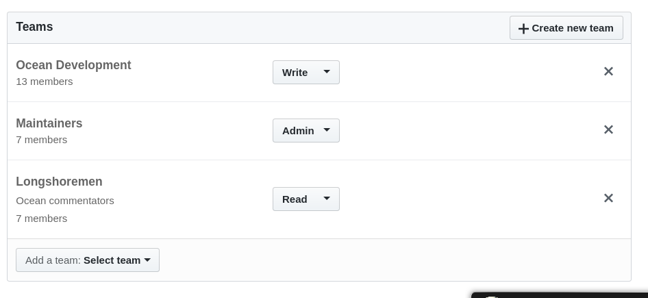
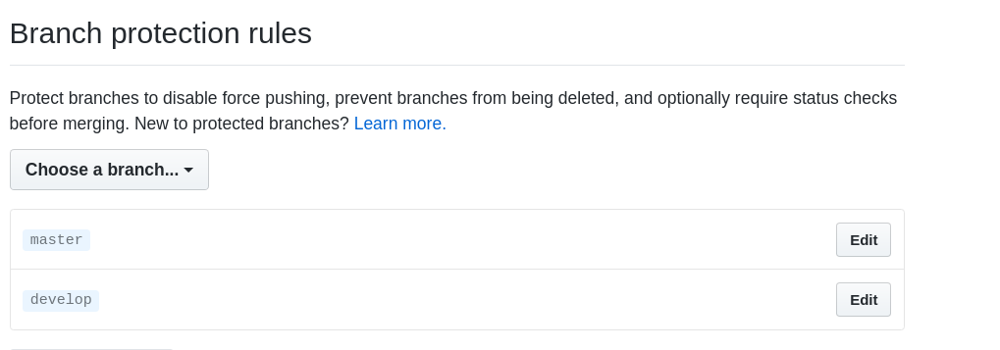
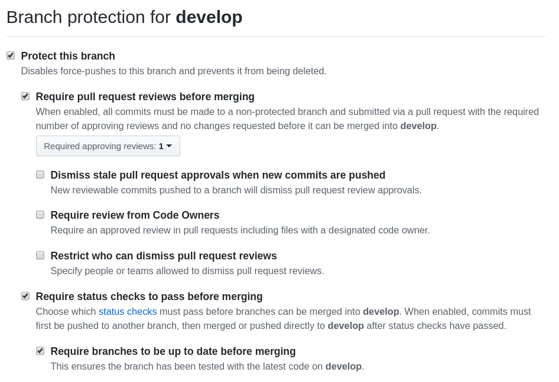

# Github default configuration

In order to have an homogeneous Github setup, it is necessary to configure all the development projects using the following approach:

## Collaborators & teams

All the development repositories just created should be configured adding the following teams:

* [Ocean Development](https://github.com/orgs/oceanprotocol/teams/ocean-development) team with **Write** grants
* [Maintainers](https://github.com/orgs/oceanprotocol/teams/maintainers) team with **Admin** grants
* [Longshoremen](https://github.com/orgs/oceanprotocol/teams/longshoremen) team with **Read** grants

The **Longshoremen** team is composed by Ocean commentators. They can have read visibility in Private repositories, enabling to get feedback before to make public a project.

Additional permissions can be required in different situations. For example, the [Token Backend](https://github.com/oceanprotocol/token-backend) project is being implemented by an external company (Fractal). So, in addition to the previous permissions, the Fractal development team is included in the [Fractal](https://github.com/orgs/oceanprotocol/teams/fractal) team with Write grants.

## Branches

### Default Branch

The default branch is considered the “base” branch in your repository. Taking into account the [Gitflow branching model](../development/branching-model.md), the default branch we should show as entry point is **master**.
The **master** branch must includes the stable & released versions of the software.

### Branch protection

**Master & develop** branches must be protected. This should avoid direct pushes to those branches or deletions. In addition to this, the following setup should be applied:

* Pull requests (PR) are required before merging
* At least, one approved review is required to merge a pull request. Critical projects could require more approvals before merging.
* Require status checks to pass before merging

Some small projects could not require **develop** branch. In those cases, this configuration applies only to **master** branch.

## Visibility

The Github repositories just created must be configured as **Private**.
This configuration must be applied until an initial stable version be released and the project includes the [required Open Source configuration](https://github.com/oceanprotocol/art/tree/master/github).

