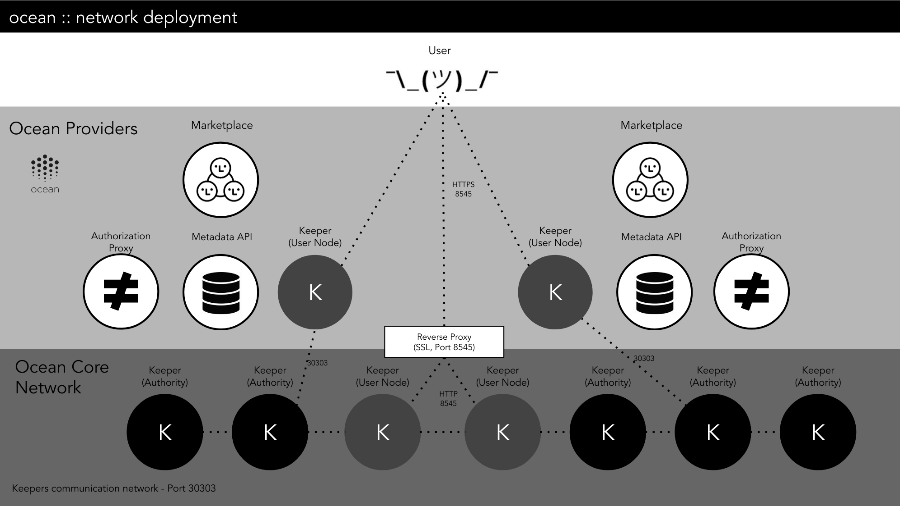

A keeper node (keeper) is basically a computer running [Parity Ethereum](https://www.parity.io/ethereum/), configured to be part of a particular [Proof-of-Authority (PoA)](https://wiki.parity.io/Proof-of-Authority-Chains) Ethereum network: one where the Ocean Protocol keeper contracts have been deployed.

> We are happy to assist you if you’re interested in running a keeper node (as a voting authority node) in the Pacific Network or the Nile Testnet. Get in touch via email under info@oceanprotocol.com.

## Using Barge

[Barge](https://github.com/oceanprotocol/barge) uses Docker Compose to run one or more keeper nodes (and other components) in Docker containers on your local machine.

- If you use `--local-pacific-node`, or `--local-nile-node`, then it will run one local Parity Ethereum node (as a _user node_, i.e. a non-voting node) and it will connect that node to the [Pacific Network](/concepts/pacific-network/) or [Nile Testnet](/concepts/testnets/#the-nile-testnet), respectively.
- If you use `--local-spree-node` or `--local-ganache-node`, then it will run a strictly-local [Spree Testnet](/concepts/testnets/#a-spree-testnet-for-local-development) or [Ganache-Based Testnet](/concepts/testnets/#a-ganache-based-testnet-for-local-development).

Barge deploys the keeper contracts to whatever keeper nodes are deployed locally.

## Ocean Parity Installation

This guide is about how to set up an _authority node_ from scratch. It started out as a guide to setting up and running a keeper node in the Nile Testnet. Its scope expanded to include other networks, including the Duero Testnet and production networks. Production networks have higher security requirements.

A Parity Ethereum node can be configured to operate in many ways, including:

- **An authority node** is one which can mine/sign new blocks. Generally speaking, public users of the network don't connect directly to authority nodes (except maybe via Websocket to subscribe to blockchain updates). The authority nodes all connect to each other via port 30303 (Ethereum listening and discovery).
- **A user/non-authority node** can't mine/sign new blocks. It connects to one or more authority nodes via port 30303 (Ethereum) so it can keep in sync with the blockchain. Public users (including marketplaces) can connect to user/non-authority nodes via RPC/HTTP (usually port 8545) or Websocket (8546), e.g. to post new transactions.
- **A secret store node** is a special case. In principle, every marketplace can set up its own network of secret store nodes. Secret store nodes aren't really involved with the blockchain aspects of the network. For more info about secret store nodes, see [the Parity wiki page about them](https://wiki.parity.io/Secret-Store.html).



A production network should have 5 or more authority nodes (operated by at least 3 different organizations), and 2 or more user nodes. If a user node is exposing its RPC/HTTP or Websocket interfaces to the public internet, then there should be a reverse proxy (such as NGINX) in front of it, so that the public connections can use SSL/TLS (HTTPS or Websocket Secure).

> Parity Ethereum is sometimes called just "Parity." Parity is also the name of the company behind Parity Ethereum, but the context should make it clear what is meant.

### Authority Node Requirements

As stated in the [Parity documentation](https://wiki.parity.io/FAQ#what-are-the-parity-ethereum-disk-space-needs-and-overall-hardware-requirements):

> Running a full node with the standard configuration for the Ethereum Mainnet requires a lot of computer resources. The blockchain download and validation process are particularly heavy on CPU and disk IO. It is therefore recommended to run a full node on a computer with multi-core CPU, 4GB RAM and an SSD drive and at least 200GB free space. Internet connection can also be a limiting factor. A decent DSL connection is required.

### Cloud Requirements

- You can choose the cloud provider and service that best fits your needs. For simplicity and general support, we have used AWS EC2 and Azure VMs to set up our nodes, but other services could be used also.
- A medium-size running instance (8 vCPUs & 16GB RAM) should be enough for executing an authority node in the network.
- As stated in the Ethereum specification, the [Enode URL format](https://github.com/ethereum/wiki/wiki/enode-url-format) does not allow DNS names. Due to this restriction, addresses must be specified using IP addresses. Make sure your cloud provider will let you use a public IP address.

### Authority Node Installation Guide

The following instructions have been used to install a node in CentOS 7 and Ubuntu 18.04. The external technologies used are systemd and Docker, both widely used today. In any case, if there is any inconvenience in using these two technologies, there is not any technical limitation to run Parity without using them, so please feel free to deploy/configure it in the way you feel most comfortable.

Always follow the best practices to secure your machine (and to keep it secure). Here are some starting points:

- [CentOS 7 Security](https://bobcares.com/blog/centos-security-hardening/)
- [Ubuntu 18.04 Security](https://help.ubuntu.com/lts/serverguide/security.html.en)

We recommend using an SSH bastion host, so the authority node doesn't have a publicly-exposed SSH port.

Here is how the authority node's firewall or security group could be set up:

- Allow incoming traffic from anywhere on ports 30303/tcp (Ethereum listener), 30303/udp (Ethereum discovery), and 8546/tcp (Ethereum Websocket).
- Don't allow incoming traffic on port 8545/tcp (the Ethereum HTTP JSON-RPC port). If you must send a JSON-RPC request to the authority node, just SSH into it and send the request to `http://localhost:8545`. Depending on what you want to do, it might be possible to send the request to a user/non-authority node instead.
- Allow incoming traffic from the SSH bastion host on port 22/tcp (SSH).

If you don't want your authority node to serve Websocket requests (except on localhost), then change the websocket/8546 configuration to be similar to the rdp/8545 configuration below.

The [Aura consensus protocol](https://wiki.parity.io/Aura) (which is the default used by Parity Ethereum for PoA networks) [requires all the clocks on the nodes to agree](https://github.com/poanetwork/wiki/wiki/Aura-Consensus-Protocol-Audit#risks-of-synchronized-time), roughly speaking. To accomplish that, you could install and run an NTP daemon on your node. Also make sure your node's firewall or security group lets it work, i.e. send requests and get responses (typically on port 123). For more tips, see [the blog post by the ZTC](https://zerotrustconsortium.org/ztc-series-1-the-quick-dos-and-donts-guide-to-parity-ethereum-blockchain/).

Below you will notice that we use the Docker image named:

`parity/parity:v2.3.3`

from Docker Hub. You might use a different Docker image, but you must ensure that it supports the Parity Secret Store extensions, since Ocean Protocol makes use of Parity Secret Store. Note: [Ocean Protocol has some Parity Ethereum Docker images in Docker Hub](https://hub.docker.com/r/oceanprotocol/parity-ethereum/tags).

The steps to follow (on the authority node) are:

1. Install Docker CE. Please check [the Docker official documentation](https://docs.docker.com/install/) for a detailed guide.

2. Configure the `systemd` unit:

```bash
cat <<EOF | sudo tee /etc/systemd/system/parity.service
[Unit]
Description=Docker Container %N
Requires=docker.service
After=docker.service

[Service]
Restart=always
ExecStart=/usr/bin/docker run\
 --name %N\
 --restart=always\
 -p 30303:30303/tcp\
 -p 30303:30303/udp\
 -p 127.0.0.1:8545:8545\
 -p 8546:8546/tcp\
 --volume=/parity_data/:/parity_data/\
 --volume=/etc/parity/:/etc/parity/\
 --entrypoint=/opt/parity/parity\
 parity/parity:v2.3.3\
 --config /etc/parity/config.toml
ExecStop=/usr/bin/docker rm -f %N

[Install]
WantedBy=default.target
EOF

sudo chmod 644 /etc/systemd/system/parity.service
```

Please note:

- The ports exposed from the container to the host are 30303/tcp (ethereum listener), 30303/udp (ethereum discovery) , 8545 (rpc interface) and 8546 (websocket interface). You can modify the host's ports (the first ports) if you want to modify the exposed ports in the host.
- The volume /parity_data is the `base_path` folder for the parity client. All the data (chain data, keys, secret store data, etc.) will be stored here. You can change the host's folder (first part) if you want to allocate in a different host location.
- The volume /etc/parity/ is the configuration folder for the parity client. The parity configuration file (`config.toml`) and the Ocean chain specification (`chain.json`), and the account password (for validators) are located in this folder. Again you can modify the local folder without major issue.

3. Add the Parity configuration file `/etc/parity/config.toml`. To understand the settings, see the [docs about configuring Parity Ethereum](https://wiki.parity.io/Configuring-Parity-Ethereum.html) and the [docs about Parity Proof-of-Authority Chains](https://wiki.parity.io/Proof-of-Authority-Chains).

```toml
[parity]
chain = "/etc/parity/chain.json"
base_path = "/parity_data"
no_persistent_txqueue = true

[rpc]
disable = false
port = 8545
interface = "all" # restrict to 127.0.0.1 (localhost) using Docker configs
cors = []
hosts = ["none"]
apis = ["all"]

[secretstore]
disable = true

[network]
nat = "extip:<PUBLIC_IP"
port = 30303
reserved_peers = "/etc/parity/peers"
node_key = "<ETHEREUM_NODE_KEY>"
discovery = true

[ui]
disable = true

[ipc]
disable = true

[dapps]
disable = true

[websockets]
disable = false
port = 8546
interface = "all"
origins = ["all"]
apis = ["pubsub"]
hosts = ["all"]

[mining]
engine_signer = "<ACCOUNT_ADDRESS>"
force_sealing = true
reseal_on_txs = "none" # Authorities reseal automatically. From https://bit.ly/2Jiw5SV
gas_floor_target = "6666666"
min_gas_price = 0 #min gas price in WEI per GAS unit (0 Ether)
# usd_per_tx doesn't mean anything on PoA networks. See https://bit.ly/2VEOwI7

[account]
password = ["/etc/parity/password"]

[footprint]
tracing = "on"
pruning = "archive"
fat_db = "on"
```

Where:

- ACCOUNT_ADDRESS: Please put here your authority account address. Example: `0xdeadbeefcafe0000000000000000000000000001`
- The file `/etc/parity/password` contains your authority account's password. You can change the location of this file, but take care that this location refers to a location inside the parity container, so you have to refer to the container location and mount the host's file to that location.
- PUBLIC_IP: The external public IP address of your node. Example: `52.1.94.55`
- ETHEREUM_NODE_KEY: The Ethereum node address. Example: `ade848e26c30d600da8207d0f8960d6abf125d1ac432bd42b020a98e10812f36`

4. Get the chain file for the network you're joining and save it in `/etc/parity/chain.json`. Here are some links to chain files:

   - [Nile chain file](https://github.com/oceanprotocol/atlantic/blob/master/networks/nile/chain.json)
   - [Duero chain file](https://github.com/oceanprotocol/atlantic/blob/master/networks/duero/chain.json)
   - Ocean Network chain file - coming some day

5. Once you have configured your files, you can enable and start the service:

```bash
systemctl enable parity-client.service && systemctl start parity-client.service
```

And check the status of the service:

```bash
systemctl status parity-client.service
```

### Additional Support Resources

- The official Parity Ethereum docs, especially:
  - [the Overview](https://wiki.parity.io/Parity-Ethereum)
  - [Configuring Parity Ethereum](https://wiki.parity.io/Configuring-Parity-Ethereum)
  - [Proof-of-Authority (PoA) Chains](https://wiki.parity.io/Proof-of-Authority-Chains)
  - [Demo PoA Tutorial](https://wiki.parity.io/Demo-PoA-tutorial)
- [The paritytech/parity-poa support channel on Gitter](https://gitter.im/paritytech/parity-poa)
- Parity (the company) offers enterprise support solutions. See [https://www.parity.io/solutions/](https://www.parity.io/solutions/)
