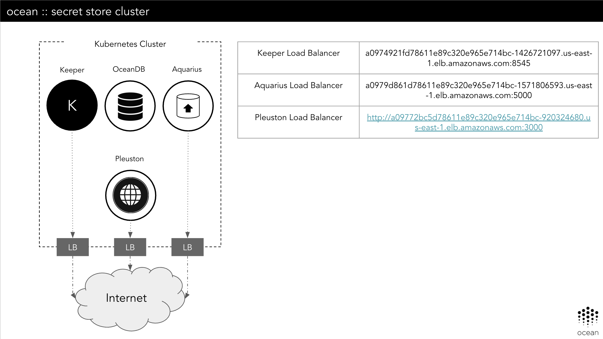

# Ocean Cluster deployed in Kubernetes

** This cluster is for Ocean internal use **

## Table of Contents

  - [Architecture](#architecture)
  - [Connection details](#connection-details)

---

## Architecture

The cluster is deployed using a Helm package. A general view about the architecture:

## Connection details

| Serice           | URL                                                                                |
|------------------|------------------------------------------------------------------------------------|
| keeper-contracts | http://ac8af1101ef0511e88a360a98afc4587-1611267666.us-east-1.elb.amazonaws.com:8545/ |
| pleuston         | http://ac8b2799bef0511e88a360a98afc4587-1424712179.us-east-1.elb.amazonaws.com:3000/ |
| aquarius         | http://ac8b5e618ef0511e88a360a98afc4587-575519081.us-east-1.elb.amazonaws.com:5000/ |
| brizo            | http://ac8b8cc42ef0511e88a360a98afc4587-974193642.us-east-1.elb.amazonaws.com:8030/ |