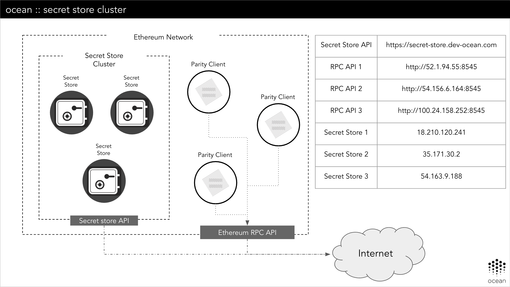

# Parity Secret Store Cluster

## Table of Contents

  - [Architecture](#architecture)
  - [Connection details](#connection-details)
  - [Client details](#client-details)
  - [HTTP Interface](#http-interface)

---

[Parity Secret Store](https://wiki.parity.io/Secret-Store-Configuration) is a (beta) feature provided by Parity ethereum client. To help with the development we have a public cluster that can be used by anyone.

## Architecture

The cluster is deployed using Packer (for generating the AMI base image) and Terraform for deploying. A general view about the architecture:


## Connection details

This parity secret store cluster is deployed in Amazon Web Services, and they are using a private ethereum network. Each server has a public ip address and a configured account. The connection details you have to add to you parity configuration file to join the same ethereum private network are:
```
bootnodes = [
  "enode://11939f77e6ff12655fce3185057443c71d2732fe85b3896033329d3278798d4ea8ff64f2e318a68b63b283b6e95ba3680fccc90ae135c1a7c6383e3439b6458a@18.210.120.241:30303",
  "enode://9e33335578ad186fd20fdafb43ee6348772812a036b99b1e5782f1b181719935a4f18398884c4c9c7fe47ab5f20d2d9ed41357eb5e037f557c4e1a82de89e137@35.171.30.2:30303",
  "enode://22d89d3c5f798d50d1bb366632e0fcaa6987f4b02a395cd979241d0a6e3c728692e690782e55a60dbd991e8354d14fcd50fd21c8bd4e98fac6913a702211ffdf@54.163.9.188:30303"
]
```

## Client details

The details about the client are:

|          | Address                                    | Public IP      |
|----------|--------------------------------------------|----------------|
| Client 1 | 0x64137af0104d2c96c44bb04ac06f09ec84cc5ae4 | 52.1.94.55     |
| Client 2 | 0xd81934365c02da201dc2b85e401ca75b48f7ccbd | 54.156.6.164   |
| Client 3 | 0x852eab9a4529cce71aa3f191da6900d57c802881 | 100.24.158.252 |


## HTTP Interface

The secret store service offers an HTTP interface to communicate with the service. The service http interface is publicly exposed with an SSL proxy, and can be accessed using *`https://secret-store.dev-ocean.com`*. The DNS query will balance between the three secret store nodes.
