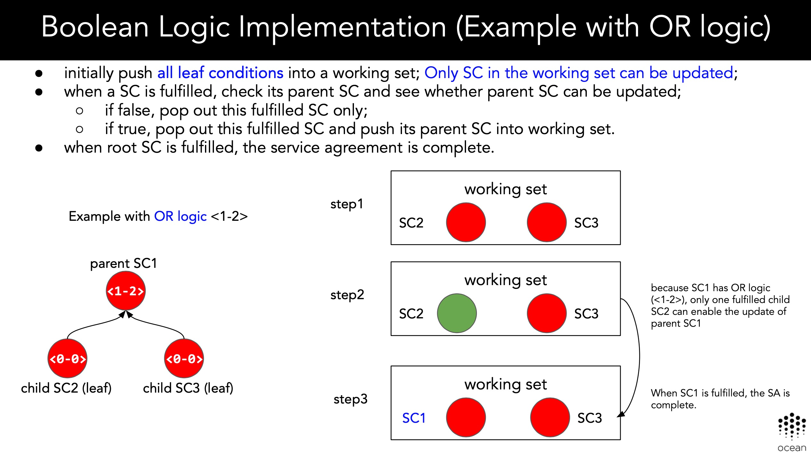
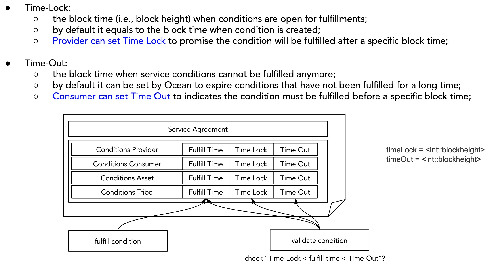

# Design of Ocean Network for Tethys

***DISCLAIMER: THIS IS A WORK IN PROGRESS***

This document provides technical details and describes the overall high-level design including all necessary modules in ocean protocol.

## 1. Overview

### 1.1 Core Modules

From the top-level point of view, there are total 9 moduels as shown in the below:


* **Ocean Token**: the native ERC20 token in Ocean network
* **Exchange**: Uniswap-like exchange built inside Ocean, where user can exchange between Ether and Ocean tokens.
* **Service Agreement**: every service is modeled as a *service agreement*. Please see [SLA.md](https://github.com/oceanprotocol/dev-ocean/blob/feature/SLA-specs/doc/sla.md) and [smart contract prototype](https://github.com/oceanprotocol/keeper-contracts/blob/develop/contracts/SLA/ServiceAgreement.sol) for details. It needs *dispute resolution* to resolve the disputes between consumer and provider. 
* **Tribe**: it controls the registry of membership for each service agreement template; defines TCR based registries for permission, which has whitelisted members who can provide or consume the service.
* **Curation**: users can curate a registry of high-quality service agreement templates through staking on corresponding bonding curves. It helps consumers discover high-quality assets/services. 
* **Governance**: it governs the available assets and services in Ocean network. For example, it whitelists new service agreement templates through TCR & Voting. 
* **Block Reward**: Ocean network will periodically release block reward (i.e., new minted ERC20 Ocean tokens) to reward the providers of data commons. Note provider of data commons must be randomly selected to fulfill the service requests so that they have the equal probability to receive block rewards.
* **Access Control**: it is the controller contract which grant access to consumers after depended conditions are fulfilled. The access token can be delivered in two approaches: secret store and OEP10. 
* **Payment**: it handles all payment processing, including lock payment, release payment and refund payment. 


### 1.2 Dependence

The core modules have dependence on each other, which can be illustrated as following. Clearly, the `service agreement` module is the fundamental building block, where many other modules depends on it.  


## 2. Module Design

In this section, each module is designed with details (some materials comes from [Research Guidance](https://docs.google.com/presentation/d/1Z6Acq2LD3eHPD1SoH_bxHH-XaOKLWemgFiKgWICekys/edit#slide=id.g44065f7377_2_1894)) and key smart contract functions are provided.

### 2.1 Ocean Token 

Ocean Token is the native and fungible tokens in Ocean network, which complies with the ERC20 Standard. 

Its total supply of Ocean Token is 1.4 billion.

45% of supply is reserved for block rewards, which will be minted according to schedule below:


The key functions in Ocean token is similar to below:

```Solidity
string public constant name = 'OceanToken';                      // Set the token name for display
string public constant symbol = 'OCN';                           // Set the token symbol for display

// SUPPLY
uint8 public constant decimals = 18;                             // Set the number of decimals for display
uint256 public constant TOTAL_SUPPLY = 1400000000 * 10 ** 18;    // OceanToken total supply

// transfer tokens 
function transfer(address _to, uint256 _value) public returns (bool);

// mint new Ocean tokens and send tokens to block reward contract 
function mintTokens() public returns (bool success);
```


### 2.2 Block Reward

Block rewards are newly minted Ocean tokens which reward providers of data commons. The overall design is shown as below:


**Key Points**:

* Block reward Ocean tokens will be minted and deposited into a reward pool;
* In the same block interval, Ocean network randomly select a provider to serve the service agreement of data commons. Therefore, all providers have the equal probability to receive the block rewards.
* When the service agreement is fulfilled and verified, provider receive a `lottery ticket` to win the block rewards;
* In the end of current block interval, Ocean network randomly choose a winner from the providers who hold `lottery ticket`.
* This chosen provider receives all tokens in the reward pool;
* The procedure will repeat for each block interval; if there is no winner, Ocean tokens in the reward pool will accumulate over time until a winner claims the reward.

The process within one block interval can be illustrated as below:


The sample smart contract looks like this:

```Solidity
// providers of data commons in this block interval
address[] candidates;

// number of reward tokens in this block interval
uint256 rewardPool;

// randomly pick a provider to receive block reward
function sendBlockReward() public returns (bool success){
	...
	// Ocean token contract mints new tokens
	OceanTokenContract.mintTokens();
	
	// randomly pick a provider from the candidates (need a secure Random Number Generator!!!)
	uint256 random = keccak256(abi.encodePacked(...)) % n;
	
	// send tokens in rewardPool to a randomly chosen provider
	transfer(candidates[random], rewardPool);
	...
};
```


### 2.3 Service Agreement
Please see [SLA.md](https://github.com/oceanprotocol/dev-ocean/blob/feature/SLA-specs/doc/sla.md) and [smart contract prototype](https://github.com/oceanprotocol/keeper-contracts/blob/develop/contracts/SLA/ServiceAgreement.sol) for details. 

**Some changes to be added:**

1. **Support `AND` and `OR` boolean logic; current prototype only support `AND` logic.**


2. **`Time Lock` and `Time Out`:**


3. **support Tri-State: Unknown, True, False**


4. **New service agreement template must go through governance and TCR to be whitelisted**. 


5. **Add current provider of data commons into block reward candidates if service agreement is fulfilled and verified.**


The sample smart contract looks like below:

```Solidity
// setup new whitelisted SA template and add it into Tribe and Curation contract
function setupAgreementTemplate(address[] contracts, bytes4[] fingerprints, uint256[] dependenciesBits, bytes32 service) public returns (bool){
	...
	// service agreement template must be whitelisted at this time
	require(service.isWhitelisted == true);
	...
	// add SA template into Tribe contract and Curation contract
	OceanTribe.addServiceTemplate(bytes32 templateId);
	OceanCuration.addServiceTemplate(bytes32 templateId);
	...
};

// instantiate template to create a service agreement (randomly choose a provider of data commons)
function executeAgreement(bytes32 templateId, bytes signature, address consumer, bytes32[] valueHash, uint256[] timeoutValues) public {
	...
	// check consumer has permission to consume the service
	if (dataset is public and free to access || consumer in Tribe registry and has permission) 
	...
};

// fulfill the service agreement (after all conditions are fulfilled)
function fulfillAgreement(bytes32 serviceId) public noPendingFulfillments(serviceId) returns(bool){
	...
	// detect new block interval and distribute tokens in current block reward pool
	if( find a new block interval) {
		// distribute block reward tokens 
		BlockReward. sendBlockReward();  
		// reset the candidate list	
		BlockReward.clearCandidateList()
	}
	...
	// add current provider of data commons into candidate list of block reward 
	BlockReward.addCandidate(address provider);
	...
};

// fulfill specific service condition (common interface)
function fulfillCondition(bytes32 serviceId, bytes4 fingerprint, bytes32 valueHash) public returns(bool);

// calculate the amount of payment released to provider and refunded to consumer
function calculatePayment(bytes32 serviceId) public returns(bool);
```


### 2.4 Payment

Payment module handls all payment processing: lock payment, release payment and refund payment. It provides query functions for external function to check the payment status of a specific service agreement.

```Solidity
// lock consumer payment
function lockPayment(bytes32 serviceId, bytes32 assetId, uint256 price) public returns (bool);

// release consumer payment to provider
function releasePayment(bytes32 serviceId, bytes32 assetId, uint256 price) public returns (bool);

// refund payment to consumer
function refundPayment(bytes32 serviceId, bytes32 assetId, uint256 price) public returns (bool);
```

### 2.5 Access Control

This module grant consumer with the access to assets. Consumer has two options to receive the access token:

* **Secret Store**: provider keeps the access token inside Secret Store (SS) and adds consumer into permission contract. As such, consumer has no direct access to the access token, which is securely stored in SS. 

	Javascript implementation of the parity secret store for use in Ocean is [here](https://github.com/oceanprotocol/secret-store-client-js).

* **OEP10 authorization**: provider delivers the encrypted access token through on-chain smart contract.

```Solidity
// grant access to the consumer in given service agreement
function grantAccess(bytes32 serviceId, bytes32 assetId) public returns (bool);
```


### 2.6 Tribe

Each service agreement template has its corresponding `Tribe` including:

* *open registry* that enables membership for this SA template;
* *provider registry* includes members who can fulfill the instantiated service agreement;
* *consumer registry* includes members who are eligible to consume the instantiated service agreement;


**How to add member into Provider registry?**

* owner of service agreement template is a provider of the instantiated service agreement by default;
* other members in the tribe shall be whitelisted through TCR in order to fulfill the service agreement.

**How to add member into Consumer registry?**

* pre-vetted users by the owner of datasets;
* consumers who makes payment for the service agreement;
* all members have access to data commons.

**How to choose Provider for SA?**:

* *data commons*: Ocean network randomly choose a provider to fulfill the service agreement request of data commons;
* *priced data*: Consumer chooses the provider to fulfill his service agreement request.


```Solidity
struct Tribe{
   // open registry of membership
	mapping(address => bool) private members;
	
	// TCR based registry for provider permission: who can provide service
	mapping(address => bool) private providers;
	
	 // TCR based registry for consumer permission: who can consume service
	mapping(address => bool) private consumers;
}

// each SA template has its corresponding Tribe struct 
mapping(bytes32 => Tribe) private tribes;

// add new member to the tribe (similarly, there is function to remove a member)
function addMember(bytes32 template_Id, address member) public returns (bool);

// add new provider to fulfill the SA (similarly, there is function to remove a provider)
function addProvider(bytes32 template_Id, address provider) public returns (bool);

// add new consumer to consume the SA (similarly, there is function to remove a consumer)
function addConsumer(bytes32 template_Id, address consumer) public returns (bool);
```


### 2.7 Curation

Curation is required in Ocean to generate a ranked list of SA sorted from high quality to low. In the decentralized settings, curation could be done with staking mechanism & bonding curves.

A bonding curves is a fixed curve that bonds reserved token (i.e., Ether or Ocean token) with a local ERC20 boned token for a specific SA:


The bonding curves determines the exchange ratio with an analytical formula, which models the price of bonded token as a function of its total supply. Usually price goes up when total supply increases, which indicates strong demand of bonded tokens.

**(1) SA as refungible NFTs**

* Each service agreement template is unique in Ocean that can be represented as a unique `ERC721 token`;
* Each service agreement template has its own fixed bonding curve along with ERC20 bonded tokens;
* The ERC20 bonded token contract is the owner of ERC721 token (SA template);
* The mining and burning of ERC20 bonded token is bonded to the fixed bonding curve.

**(2) The design structure**:


**(3) Staking and mint new bonded token**:


**(4) Unstaking and burn bonded token**:


The example smart contract functions for curation are below:


```Solidity
TODO: SA template inherits ERC721 standard and set its owner to be ERC20 bonded token contract.
```

The Bonded tokens is fungible ERC20 token as following:

```Solidity
// transfer tokens 
function transfer(address _to, uint256 _value) public returns (bool);

// mint new tokens for buyDrops transaction
function mintTokens() public returns (bool success);

// burn tokens for sellDrops transaction
function burnTokens() public returns (bool success);
```


### 2.8 Dispute Resolution

Consumer can raise dispute before *TIME-OUT* and *PAYMENT-RELEASED* in the service agreement. 

If dispute exists, the consumer payment is locked and cannot be released before the dispute is resolved.

To resolve the dispute, there are two approaches:

* **Voting based resolution**: it enables expert verification (or arbitration) with permissioned voting on the disputes. 
* **TCR based resolution**: it enables community opinion since all community members can vote on the disputes, which will be resolved based on TCR results.


```Solidity
struct Dispute {
   // TCR based resolution for community opinion
	uint256 challenge;
	
	// voting based resolution for human verification
	PLCRVoting  voting; 
	
	// status
	bool  status;
}

// each SA instance has its own Dispute struct
mapping(bytes32 => Dispute) private disputes;

// consumer raise dispute for a given service agreement instance before timeout & release payment
function addDispute(bytes32 serviceId) public returns (bool){
	...
	 // set “dispute=true” flag in service agreement to prevent the release of payment
	ServiceAgreement.disputeExist(bytes32 serviceId);
	...
};

// resolve dispute with two approaches
function resolveDispute(bytes32 serviceId) public returns (bool);
```


### 2.9 TCR (Token Curated Registry)
**1. Concept**

TCR is a common module that can be used by many different components. Our TCR is derived from Mike Goldin's prototype of TCR. 


**2. Event Driven Design**

TCR may be used for different registries (such as SA template, dispute resolution and tribe registry), therefore, the whitelisting result needs to trigger corresponding actions depends on the TCR voting results.

Similar to SA event triggering design, the various actions are triggered by event messages:

* Applications are submitted to TCR for voting;
* If application is whitelisted, TCR contract emits an event message including all critical information;
* The external controller contract is listening to the events from TCR for a specific application;
* When received the message, the controller contract can trigger the action such as add new SA template into the registry. 


The sample smart contract is below:

```Solidity
// each application has Listing struct
mapping(bytes32 => Listing) private listings;

//  each challenge has Challenge struct that keeps track of votes and result
mapping(uint => Challenge) private challenges;

// submit application
function apply(bytes32 _listingHash, uint _amount, uint _type, string _data) public;

// challenge an application
function challenge(bytes32 _listingHash, string _data) external returns (uint challengeID);

// resolve an challenge
function resolveChallenge(bytes32 _listingHash) private;

// update registry
function updateRegistry(bytes32 listingHash) public {
	...
	// TODO: emit an event to add new item into a specific registry
	emit isWhitelisted(...);
	...
}
```


### 2.10 Voting 

Voting module is based on PLCRVoting implementation. 

One change to be added is to enable **permissioned voting**, where only voters on the whitelist/registry can participate in the voting.


```Solidity
// voting struct
struct Voting {
	// whether the voting is restricted to a group of voters in the mapping below
	bool restrictedVoting;
	
	// define the list of voters for specific voting
	mapping(address => bool) voters;
}

// each voting has its own Voting struct
mapping(bytes32 => Voting ) private votings;

// grant access to the consumer in given service agreement
function commitVote(bytes32 id) public returns (bool){
	...
	 // check voter’s permission if needed
	if (votings[id]. restrictedVoting == true ){
		require(votings[id]. voters[msg.sender] == true);
	}
	...
	
};
```

## 3. Integration of Ocean Modules

These different modules can be put together in the below diagram. 

It illustrates the interaction between contracts. 


