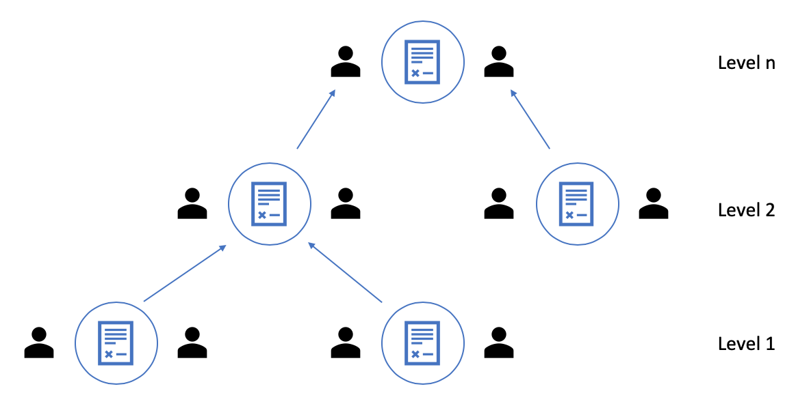

# Service Agreements in Ocean Protocol

Ocean Protocol is a network enabling discovery and trust between service (data and related services) providers and consumers. To enable delivery and payment for these services, we need pre-signed agreements between the providers and consumers. These service agreements can greatly help with setting expectations and defining terms of delivery in a permission-less network. The goal for having service agreements is to have all important elements for services delivery and consumption at the same place.

The service agreements in Ocean Protocol will be deployed and executed on-chain, on the Ocean keeper network. For this to work seamlessly, its important that the primitives for service agreements should be identified.

This document provides an over-view or a blueprint for Service Agreements in Ocean Protocol and their primitives.

*This is a work in progress.*

## Services

On a high-level, the services published and provided as part of a marketplace based on Ocean Protocol are,

1. Data (data sets)
1. Algorithms
1. Compute
1. Storage
1. Verification (data, compute results or both)
1. Combination of some of the above (bundles)

## Service Agreements

For providing and consuming the services listed above, a service agreement should define the following elements,

1. Service provider(s) and consumer - The agreement should identify the involved parties in the service delivery.
1. Scope of delivery - The service agreement should clearly define what services are to be provided.
1. Conditions of delivery - The service agreement should also define the conditions of delivery of services. These conditions should be proposed by the provider and should be agreed on by the consumer.
1. Verification (optional)- If needed, a service agreement should define the conditions and scenarios for verification of delivery of service.
1. Disputes and settlement - A service agreement should define a process for handling disputes between the service provider and consumer. The dispute resolution can be on-chain (verification and/or voting) or off-chain (third party arbitration).
1. Payment - The service agreement should also provide the terms and conditions of payment from the consumer to the provider.

## Service Agreements in context of Ocean Components

In the context of Ocean Protocol components, following scenarios are important for setting up service agreements.

### Tribes and/or marketplaces (publishing data sets)

All services must be registered/published at one of the tribes/marketplaces associated with Ocean Protocol. The result of the registration of service should be generation of a service identifier which can be used to identify a service in a service agreement.

As part of publishing a service, the conditions of availability should also be published with the service metadata. For example,

1. If a data set is being published as a service, the state of data should be clearly mentioned - raw, clean, transformed, etc.
1. If an algorithm is being published as a service, the language in which the algorithm is available should also be published.

### Providers (serving meta-data and/or data)

In some cases, the data will be served by the provider *on behalf of* the data-set owner. In these cases, the service agreement should clearly mention the data-set owner and the provider. The data-set owner is providing data as service and the provider is providing hosting infrastructure as a service.

If a provider is proving additional services on top of data - compute, etc. then they should also be published on the market-place.

### Bundling of services

Ocean being a multi-party marketplace for data and associated services, there will be scenarios when a sub-set of services from different providers can be bundled together to have more value for a data set. For example,

1. Data + compute
1. Data + algorithm
1. Data + algorithm + compute
1. and so on...

In scenarios such as these, it's important to have lower-level service agreements (sub-contracts) which can be combined to form a high-level service agreement. For example, if a data set owner and a compute provider would like to create a combined offering by associating with each other, they should first have a service agreement between each other. In this lower-level service agreement, the data-set owner can be the consumer and the compute provider can be the service-provider.



The overall idea is to support hierarchical service-agreements so that services can be bundled together for a better offering to the end-consumer. This would also reduce the responsibility on the consumer to find all the relevant providers for an end-to-end service.

### Sensitive data or large data (data that cannot leave its premises)

If a data owner is publishing a data set which is too large or too sensitive to leave its premises, it's important for better consumption, that they must provide and bundle the compute service with the data. The service agreement between the data owner and the consumer will then be prepared accordingly.

### Third-party verification of services delivery

Third party verifiers are also considered service providers in the context of Ocean Protocol. If a service provided needs third-party verification then the verification service should also be part of the same service agreement. This would then be a service agreement between at least three parties - consumer, service provider(s) and verifiers (also service providers). The verification service should also be registered/published via an Ocean marketplace.

### Payments and escrows

The service agreement should provide clear terms for processing of payments. For a fair game, the service agreements should have a provision of payment using escrows where both the provider and the consumer should lock a minimum deposit. Once the service is provided, the payments should be unlocked for both parties.

### Terms of payment

As per the nature of the services provided as part of Ocean Protocol, the service agreements can follow primarily two types of payment terms.

1. Fixed Fee - For a single instance of service provided (running an algorithm on a data-set and returning results), the terms of payment can be a one-time fixed fee.
1. Time and Material - For a continuous set of services, a time and material service agreement can also be set-up between the consumer and the provider. (Think of it as hiring a delivery provider when selling your product on Amazon.)
    1. Bundling of compute with data for all instances of data consumption (mostly relevant at lower-levels, sub-contracts)
    1. Verification of results for all data sets consumed. This is relevant for scenarios where a consumer would like to hire a verifier using a blanket agreement for getting all services verified.

### Dispute resolution

The service agreements should provide a mechanism to support dispute resolution. In case of a dispute raised by the consumer, the payment locked in escrow should stay locked until the dispute is resolved.

To resolve disputes on-chain, the service agreement should have pre-defined dispute resolution functions which can be called to initiate one or more of the following,

1. On-chain deterministic compute
1. Third-party verification
1. Voting via TCR

Once the dispute is resolved using any of the above options, the payments should be unlocked.

If a dispute cannot be resolved by these on-chain options, the service agreement should have a provision to escalate the dispute to off-chain arbitration. In that case, the payments should be unlocked after manual intervention once the dispute has been resolved.

### Service agreement negotiation (off-chain)

Before the service agreements are deployed or invoked as smart-contracts on the Ocean keeper network, they should be negotiated off-chain between all the involved parties.

One way of approaching this would be to add service agreement templates as simple JSON objects in the metadata store for Ocean marketplace. The following JSON object shows how a service agreement can be represented.

```json
{
    "services": [
        {
            "serviceId": "abcdef1234",
            "serviceProviderId": "5678fedcba",
            "consumerId": "did:ocn:1234567890",
            "cost": 100,
            "deposit": 10
        },
        {
            "serviceId": "abcdef1234",
            "serviceProviderId": "5678fedcba",
            "consumerId": "did:ocn:0987654321",
            "cost": 5000,
            "deposit": 500
        }
    ],
    "on-chain-verification": {
        "function": "",
        "input": "",
        "expectedOutput": ""
    },
    "third-party-verification": {
        "verifierId": "",
        "verificationParameters": "",
        "verificationFunction": ""
    }
}
```

Once all the involved parties agree on the values for the fields in the JSON object, these values can then be passed to a smart-contract for invocation and set-up of on-chain service agreement.

## References

1. [Simple service agreement template](https://www.docracy.com/0y5gb5cl0hc/simple-software-services-agreement)
1. [Sub-contractor agreement template](https://www.pandadoc.com/subcontractor-agreement-template/)
1. [SLA template](http://www.slatemplate.com/)