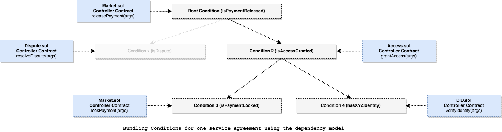
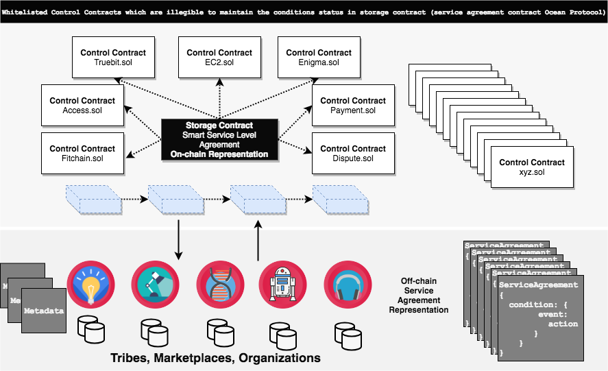
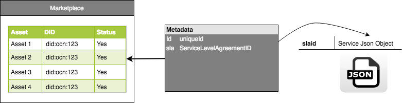
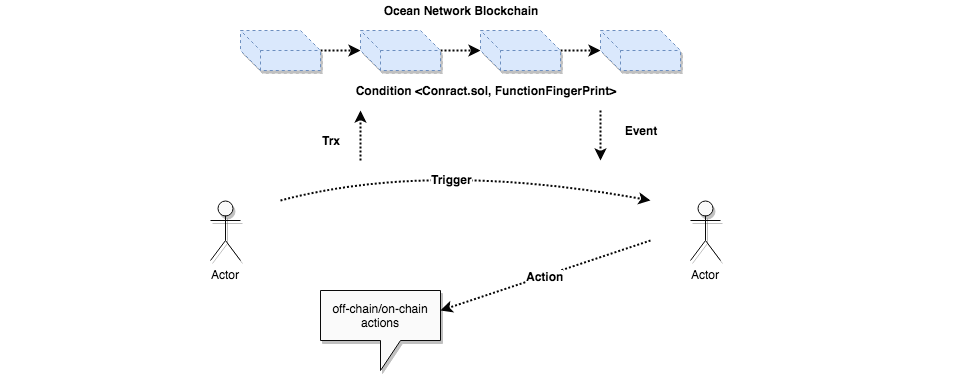

# Merkelized Service Level Agreement

***DISCLAIMER: THIS IS A WORK IN PROGRESS***

This document provides technical details and describes the design of `merkelized service level agreements` 
in ocean protocol.


## Definition

### Service

Service agreement is a commitment between provider/s and consumer of a service. In this commitment, the provider and 
consumer agree on quality, availability, and responsibilities involved in the service.


### Condition

A service provider defines one or more SLAs that apply to their services. Any defined  service 
between parties may/not be associated with a set of conditions
 and `asset/s`. In Ocean Protocol, a SLA is expressed as a set of `conditions` with 
 dependencies where any condition is defined as follows:
 


- Control Smart Contract Address: This defines the business logic concerning one or more conditions
in the service agreement. This applies [Storage-Control Pattern](#storage-control-pattern)
- Function Fingerprint: For each condition in the control smart contract, there is a function 
fulfills only one condition
- Dependency Conditions (*Optional*): enforces the execution of the dependency model for this condition 
in terms of list of condition/s that must be fulfilled. The dependency model is defined in terms of tree structure 
in order to avoid any circular dependency and satisfy the `termination` and `correctness` of the model as shown below:



## Components

### 1. SLA Contract

The service level agreement contract is meant to be a storage contract in which stores the status of conditions for each service. This 
is used to be minimize the interaction between control contracts and decouple the business logic by splitting it into smaller logic or control contracts. In this way, 
we can reuse the control contracts (pre-defined conditions) to define any kind of service agreements.
For more information about implementation details check out the [Keeper Contracts](#) section.

### 2. Control Contracts

Control contracts may define the business logic for one or more conditions. As a service provider (i.e marketplace), has the 
right to define conditions by using pre-defined control contracts such as TCR, identities, payments, incentives, token swapping, access,
 etc. or define their own control  contract which implements new conditions. The newly defined 
 control contracts will be whitelisted according to the governance model 
in ocean (ie. It could be TCR based governance approach or community based governance approach). Finally as a consumer you are illegible to `accept/reject`
the service level agreement.  



### 3. Conditions

In Ocean Protocol, Condition has two representations. The first representation defines 
the `event` and the associated `action` where stakeholders (consumers, tribes, marketplaces, 
data scientists, etc.) store it ( in terms of json object) `off-chain`. 
This will enable parties to track the progress of the service agreement. This model is defined as 
[event-action model](#event-action-representation). The second representation is a compressed version of 
the json object and stored `on-chain`. This compressed version holds only the minimal required information 
in order to maintain the stat of the condition in the smart service agreement (on-chain).

#### Event-Action Representation

The below json shows how the service parties interact based on [Trigger-Event-Action](#event-action-pattern) pattern which 
represents the core orchestration pattern in Ocean Service Agreement. 

```json
{
  "serviceAgreementId":{
    "version":"0.1",
    "conditionName":{ 
        "controlContract":{
          "address":"0x123456789abcdef",
          "function":"<Function FingerPrint>",
          "description":"SHOW THIS DESCRIPTION IN FRONTEND"
        },
        "events":{
            "eventName":[
              { // All actions are user defined (by service provider) and will not be store on-chain
                "action":"callback function", // the coressponding action 
                "parameters":{ // mapping parameters from event to action [optional]
                  "event.x": "x",
                  "event.y": "y"
                }
              }
            ]
        },
        "dependency":[{
          "dependencyConditionName": true  // dependency condition status
        }]
    }
  }
}
```
The emitted events are generated by the control/logic contract (smart contract) and handled by the parties that are associated 
to listen to this event. Each event  triggers one or more action/s. These actions are defined 
by the service agreement provider. As a result this will give any entity (tribe, 
organization, consortium, or marketplace) the `optionality` to define there own internal 
actions and integrate their off-chain services using the same way.

Event example in control contract (Best Practice):
```javascript
// use the same function name in the control contract, but keep the first character capital as follows

IsPaymentLocked(bytes32 serviceId, bytes32 conditionId, bool status, address party)

function isPaymentLocked(bytes32 serviceId, bytes32 conditionId, address provider, address arg2){
    ...
    // TODO: user defined business logic in the control contract
    emit IsPaymentLocked(serviceId, conditionId, status, provider);
}
```

#### On-chain Representation

The on-chain representation stores the minimal data associated with a condition 
as shown in the [condition definition section](#condition). The following data structure is 
defined in a `solidity code`:

```javascript

    struct Condition{
        bool status;
        bytes32 [] dependency;
    }
    
    struct Agreement{
        bool status;
        bytes32 [] assets;
        address [] parties;
        mapping (bytes32 => Condition) conditions;
    }
    
    mapping (bytes32 => Agreement) agreements;

```


### 4. Access Control

Access control in the service agreement is defined by control contract address. If the caller (smart contract address) 
has the right to maintain the state of the condition in the storage contract (service agreement contract), the storage contract will grant the control contract an access using 
the following modifier:

```javascript

    modifier isValidControlContract(bytes32 service, bytes32 functionHash){
        // check if the caller is the condition owner (control contract)
        bytes32 condition = keccak256(abi.encodePacked(msg.sender, functionHash));
        // check if all the dependency conditions are fulfilled!
        if(agreements[service].conditions[condition].dependency.length > 0) {
            for (uint256 i=0; i < agreements[service].conditions[condition].dependency.length; i++) {
                require(agreements[service].conditions[agreements[service].conditions[condition].dependency[i]].status == true);
            }
        }
        _;
    }
```

### 5. Treaty Interface

The control contracts should implements the `treaty interface`. This interface has only two functions in which 
used to fulfill and un-fulfill the conditions in the storage contract (service agreement contract). The interface
is defined as follows:

```javascript
pragma solidity ^0.4.24;

contract Treaty{
    function fulfillCondition(bytes32 service, 
                              bytes32 condition, 
                              bytes32 functionHash) public returns (bool);
    function unfulfillCondition(bytes32 service, 
                                bytes32 condition, 
                                bytes32 functionHash) public returns(bool);
}
``` 

## Storing and Upgrading SLA

As mentioned before, the service agreement has two representation, this [event-action](#event-action-representation) representation stored in OceanBD/Provider-py and 
the [on-chain agreement](#on-chain-representation) representation is stored in the service agreement storage contract.

The service agreements could be upgraded by the service provider at anytime but once the smart contracts are deployed 
on the network, there is no way to delete them. As a result, the smart contract should maintained by 
the governance model and upgraded by pointing to a newly defined smart contracts. The upgrading mechanism
 uses a directory service contract which acts as Key/value store that allows the logic/control to 
 call other contracts i.e storage contract also service contract maintains the versioning status in 
 interfaces and logic. For more information about implementation details of [Directory Service Contract](#) section.

## Implementation Requirements in Ocean components

This section describes the implementation requirements for the software components of Ocean protocol in order to 
integrate the service level agreement model

### Squid-lib
Squid library ([js](https://github.com/oceanprotocol/squid-js), [python](https://github.com/oceanprotocol/squid-py))
is meant to be an interface which includes the methods to make easy the connection with contracts deployed in different 
networks. This repository include also the methods to encrypt and decrypt information. The role of Squid is to:

- CRUD operations for service level agreement in OceanDB or [Provider-py](https://hub.docker.com/r/oceanprotocol/provider/)
- Setup a service level agreement on-chain which is signed by the consumer
- Trigger condition calls in control contracts (send transactions)

Triggering conditions by invoking transactions on-chain, this interface should be designed to 
handle the defined condition in off-chain service agreement in a generic way.

```python

def trigger_condition(conditionInvokeFunction, parameters, serviceId, conditionId):
    # TODO: generic Interface to invoke condition Transaction in a service agreement
    return reciept
    
# setup a service agreement on-chain
def setup_agreement(control_contracts, dependencies, fingerprints, signature):
    # signature : consumer's signature for the data as follows:
    # for each condition in control_contracts:
    #    text += contractAddress+fingerprint[i]+dependencies[i]
    # signature = ECDSA_sign(text)by_consumer_public_key
    # TODO: setup on-chain agreement (call setup service agreement in ServiceAgreement.sol)
    return status
```

### Provider node

Provider node uses bigchainDB in order to store the metadata. The required update in this repository includes
the ability to attach and detach a predefined service level agreement into an existing asset metadata.



Finally the implementation of CRUD APIs of service level agreement [schema](#event-action-representation) for Squid.
  
### Keeper contracts

The keeper contracts needs to be refactored in which follow the [storage-control](#storage-control-pattern). 

#### Service Level Agreement Contract

The below source code show the required functions in `service level agreement` in ocean:

```javascript
pragma solidity ^0.4.25;

contract SLA{
    
    struct Condition{
        bool status;
        bytes32 [] dependency;
    }
    
    struct Agreement{
        bool status;
        int count;
        bytes32 [] assets;
        address provider;
        mapping (bytes32 => Condition) conditions;
    }
    
    mapping (bytes32 => Agreement) agreements;
    
    modifier isValidControlContract(bytes32 service, bytes32 functionHash){
        // check if the caller is the condition owner (control contract)
        bytes32 condition = keccak256(abi.encodePacked(msg.sender, functionHash));
        // check if all the dependency conditions are fulfilled!
        if(agreements[service].conditions[condition].dependency.length > 0) {
            for (uint256 i=0; i < agreements[service].conditions[condition].dependency.length; i++) {
                require(agreements[service].conditions[agreements[service].conditions[condition].dependency[i]].status == true);
            }
        }
        _;
    }
    
    function generateServiceID(bytes _signature, uint256 _contracts) private view returns (bytes32) {
        return keccak256(abi.encodePacked(_signature, _contracts, block.timestamp));
    }
    
    function setupAgreement(address[] _contracts, 
                            bytes32[] _fingerprints, 
                            uint256 [] _parents, 
                            bytes _signature,
                            bytes32 [] _assets)  public returns(bool) {
       // check conditions length
       require(_contracts.length > 0);
       require(_contracts.length == _fingerprints.length);
       require(_contracts.length == _parents.length);
       // TODO: verify the consumer's signature
       bytes32 service = generateServiceID(_signature, _contracts.length);
       for (uint256 i; i < _contracts.length;  i++){
            bytes32 condition = keccak256(abi.encodePacked(_contracts, _fingerprints));
            // TODO: check if the condition is whitelisted
            
            
       }
    }
}
```

#### Directory Service Contract

TBC

#### Control Contract Example

TBC
  
### Relay/Event handler
  
### UI/frontend interface/CLI
  

## Flow
What are the steps involved in setting up and executing a service agreement. 


## Marketplace Reference Architecture

TBC

## Curating Service Agreements

TBC

## Appendix

### Storage-Control Pattern

TBC

### Event-Action Pattern

The event-action pattern is close to [Event-driven Architecture](https://en.wikipedia.org/wiki/Event-driven_architecture). It 
is specified as model to represents the interaction between parties. As shown in the below figure:



TBC


## References
- []()