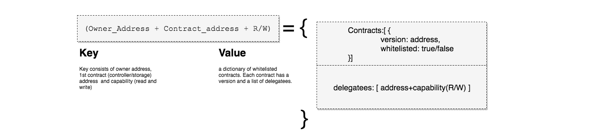
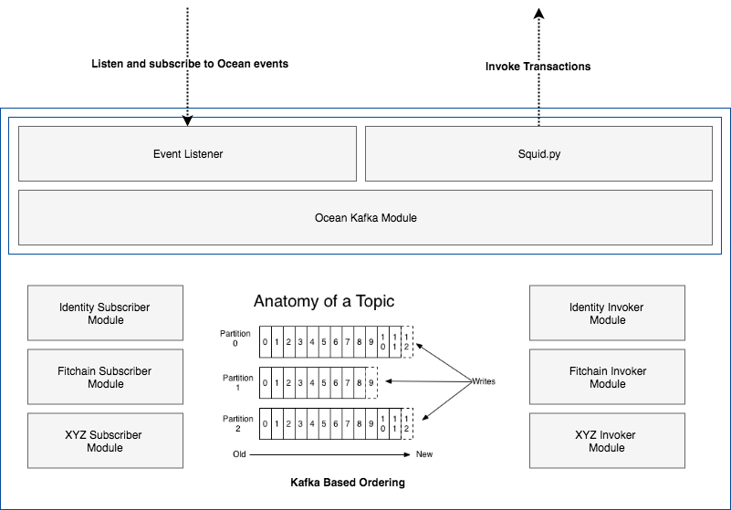
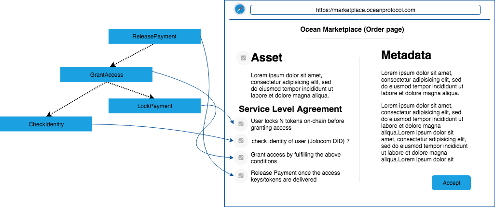
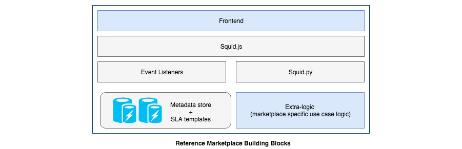
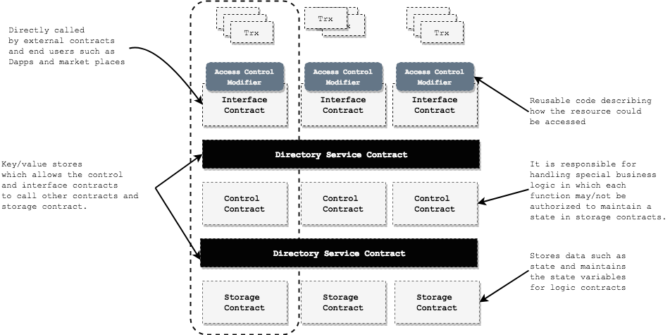

# Merkelized Service Level Agreement

***DISCLAIMER: THIS IS A WORK IN PROGRESS***

This document provides technical details and describes the design of `merkelized service level agreements` 
in ocean protocol.


<!--ts-->

Table of Contents
=================

   * [Table of Contents](#table-of-contents)
   * [Definition](#definition)
      * [Service Agreement](#service-agreement)
      * [Condition](#condition)
   * [Components](#components)
      * [SLA Contract](#1-sla-contract)
      * [Controller Contracts](#2-controller-contracts)
      * [Conditions](#3-conditions)
        * [Event-Driven Representation](#event-driven-representation)
        * [On-chain Representation](#on-chain-representation)
      * [Access Control](#4-access-control)
      * [Treaty Interface](#5-treaty-interface)
   * [Storing and Upgrading SLA](#storing-and-upgrading-sla)
   * [Implementation Requirements](#implementation-requirements)
      * [Squid-lib](#squid-lib)
      * [Provider node](#provider-node)
      * [Keeper contracts](#keeper-contracts)
        * [Service Level Agreement Contract](#service-level-agreement-contract)
        * [Treaty Implementation](#treaty-implementation)
        * [Directory Service Contract](#directory-service-contract)
        * [Controller Contract Example](#controller-contract-example)
      * [Event Consumer/Listener](#event-consumerlistener)
      * [Ocean Relay](#ocean-relay)
      * [UI/frontend interface/CLI](#uifrontend-interfacecli)
   * [Flow](#flow)
   * [Marketplace Reference Architecture](#marketplace-reference-architecture)
   * [Appendix](#appendix)
     * [Function Fingerprint](#function-fingerprint)
     * [Controller-Storage Pattern](#controller-storage-pattern)
     * [Event-Driven Architecture](#event-driven-architecture)
     * [Security Threats](#security-threats)
   * [References](#references)

<!--te-->


## Definition

### Service Agreement

Service agreement is a commitment between provider/s and consumer of a service. In this commitment, the provider and 
consumer agree on quality, availability, and responsibilities involved in the service.


### Condition

A service provider defines one or more SLAs that apply to their services. Any defined  service 
between parties may/not be associated with a set of conditions
 and `asset/s`. In Ocean Protocol, a SLA is expressed as a set of `conditions` with 
 dependencies where any condition is defined as follows:
 


- ***Controller Smart Contract Address:*** This defines the business logic concerning one or more conditions
in the service agreement. This applies [Controller-Storage Pattern](#controller-storage-pattern)
- ***Function Fingerprint:*** For each condition in the controller smart contract, there is a function fulfills only one condition For more information check out the 
[appendix - function fingerprint](#function-fingerprint). 
- ***Dependency Conditions (*Optional*):*** enforces the execution of the dependency model for this condition 
in terms of list of condition/s that must be fulfilled. The dependency model is defined in terms of tree data structure 
in order to avoid any circular dependency and satisfy the `termination` and `correctness` of the model as shown below:


Any entity, organization, tribe could bundle and use the same conditions in order to define different service level agreements. 
This approach provides more `granularity` and `optionality` for the service level agreement definition. Moreover
it enable the service providers to integrate new conditions using the same pattern.
 
## Components

### 1. SLA Contract

The service level agreement contract is meant to be a [Storage contract](#controller-storage-pattern) which maintains the status of conditions for a service. This 
is used to minimize the interaction between [controller contracts](#controller-storage-pattern) and decouple the business logic by splitting it into smaller logic (controller contracts). Consequently, 
we can reuse the controller contracts (pre-defined conditions) to define any kind of service agreements.
For more information about implementation details check out the [Keeper Contracts](#keeper-contracts) section.

### 2. Controller Contracts

Controller contracts may define the business logic for one or more conditions. As a service provider (i.e marketplace), has the 
right to define conditions by using pre-defined controller contracts such as TCR, identities, payments, incentives, token swapping, access,
 etc. or define their own controller  contract which implements new conditions. The newly defined 
 controller contracts will be whitelisted according to the governance model 
in ocean (ie. It could be TCR based governance approach or community based governance approach). Finally as a consumer you are illegible to `accept/reject`
the service level agreement during the setup phase.


### 3. Conditions

In Ocean Protocol, A Condition has two representations. The first representation defines 
the off-chain representation in terms of `controller contract address`, `function fingerprint`, `description`, the `event` and the associated `action` where stakeholders (tribes, marketplaces, 
data scientists, etc.) store it `off-chain` ( in terms of json object). 
This will enable parties to interact asynchronously and track the progress of the service agreement. This model is based on
[the event-driven design pattern](#event-driven-architecture). The second representation is a compressed version of 
the `off-chain json object` and stored `on-chain`. This compressed version holds only the *minimal required information* 
in order to maintain the state of the condition on-chain.

#### Event-Driven Representation

The below json object shows a generic definition of off-chain SLA object. 

```json
{
  "serviceAgreementId":{
    "version":"0.1",
    "conditionName":{ 
        "controlContract":{
          "address":"0x123456789abcdef",
          "function":"<Function FingerPrint>",
          "description":"SHOW THIS DESCRIPTION IN FRONTEND"
        },
        "events":{
            "eventName":[
              { // off-chain_[optional]_and_defined_by_Service_Agreement_Provider
                "action":"callback function",
                "parameters":{ 
                  "event.x": "x",
                  "event.y": "y"
                }
              }
            ]
        },
        "dependency":[{
          "dependencyConditionName": true  // dependency condition status
        }]
    }
  }
}
```
The emitted events are generated by the control/logic contract (smart contract) and handled by the parties that are associated 
to listen to this event. Each event  triggers one or more action/s. These actions are defined 
by the service agreement provider. Therefore, it provides any entity (tribe, 
organization, consortium, or marketplace) the `optionality` to define their own internal 
actions and integrate their off-chain services.

Event example in controller contract (Best Practice):
```javascript
// sample event emitted by condition <ControllerContract + fingerprint(lockPayment(bytes32, bytes32, address, address))
event PaymentLocked(bytes32 serviceId, bytes32 conditionId, bool status, address party)

function lockPayment(bytes32 serviceId, bytes32 conditionId, address provider, address arg2){
    ...
    // TODO: user defined business logic in the controller contract
    emit PaymentLocked(serviceId, conditionId, status, provider);
}
```

#### On-chain Representation

The on-chain representation stores the minimal data associated with a condition 
as shown in the [condition definition section](#condition). The following data structure is 
defined in a `solidity code`:

```javascript

    struct Condition{
        bool status;
        bytes32 [] dependency;
    }
    
    struct Agreement{
        bool status;
        bytes32 [] assets;
        address provider;
        bytes32[] conditions;
    }
    
    mapping (bytes32 => Agreement) agreements;
    mapping (bytes32 => Condition) conditions;

```


### 4. Access Control

Access controller in the service agreement is defined by controller contract address. If the caller (smart contract address) 
has the right to maintain the state of the condition in the storage contract (service agreement contract), the storage contract will grant the controller contract an access using 
the following modifier:

```javascript

    modifier isValidControllerContract(bytes32 service, bytes32 functionHash){
        // check if the caller is the condition owner (controller contract)
        bytes32 condition = keccak256(abi.encodePacked(msg.sender, functionHash, service));
        // check if all the dependency conditions are fulfilled!
        if(conditions[condition].dependency.length > 0) {
            for (uint256 i=0; i < conditions[condition].dependency.length; i++) {
                require(conditions[conditions[condition].dependency[i]].status == true);
            }
        }
        _;
    }
```

### 5. Treaty Interface

The controller contracts should implements the `treaty interface`. This interface has only two functions in which 
used to fulfill and un-fulfill the conditions in the storage contract (service agreement contract). For more information about implementation details, checkout this [section](#treaty-implementation).
## Storing and Upgrading SLA

#### Storing SLA

As mentioned before, the service agreement has two representations, the [off-chain json object](#event-driven-representation) representation is stored in OceanBD/Provider-py and 
the [on-chain agreement](#on-chain-representation) representation is stored in the service agreement storage contract.

#### Upgrading SLA
The service agreements could be upgraded by the service provider at anytime but once the `controller contracts` smart contracts are deployed 
on the network, there is no way to change them. As a result, the smart contract should be maintained and upgraded according to 
the governance model in ocean. The upgrading mechanism
 uses a directory service contract which acts as Key/value store that allows the logic/controller to 
 call other contracts i.e storage contract. Moreover this contract maintains the versioning status of
 interfaces and controller contracts. For more information about implementation details of [Directory Service Contract](#directory-service-contract) section.

## Implementation Requirements

This section describes the implementation requirements for the software components of Ocean protocol in order to 
integrate the service level agreement model

### Squid-lib
Squid library ([js](https://github.com/oceanprotocol/squid-js), [python](https://github.com/oceanprotocol/squid-py))
is meant to be an interface which includes the methods to facilitates the interaction with the deployed smart contracts in Ocean Protocol. 
This repository includes also the methods to encrypt and decrypt information. 

**The required APIs for the SLA in Squid as follow:**

- CRUD operations for service level agreement in OceanDB or [Provider-py](https://hub.docker.com/r/oceanprotocol/provider/)
- Setup a service level agreement on-chain which is signed by the consumer
- Generic function which triggers condition calls in controller contracts (send transactions)

```python

def trigger_condition(conditionInvokeFunction, parameters, serviceId, conditionId):
    # TODO: generic Interface to invoke condition transaction in a service agreement
    return reciept
    
# setup a service agreement on-chain
def setup_agreement(control_contracts, dependencies, fingerprints, signature):
    # signature : consumer's signature for the data as follows:
    # for each condition in control_contracts:
    #    text += contractAddress+fingerprint[i]+dependencies[i]
    # signature = ECDSA_sign(text)by_consumer_public_key
    # TODO: setup on-chain agreement (call setup service agreement in ServiceAgreement.sol)
    return status
```

### Provider node

Provider node uses bigchainDB in order to store the metadata. The required update in this repository includes
the ability to attach and detach a predefined service level agreement into an existing asset metadata.


**Implementation Requirements:**

- The provider should provide CRUD APIs of service level agreement [schema](#event-driven-representation) for Squid.
  
### Keeper contracts

The keeper contracts needs to be refactored in order to satisfy the  [controller-storage pattern](#controller-storage-pattern). The following
contracts are used to be a guide for implementation details of the service level agreement in keeper-contracts repo.

#### Service Level Agreement Contract

The below source code show the required functions in `service level agreement` in ocean:

```javascript
pragma solidity ^0.4.25;

contract SLA{
    
    struct Condition{
        bool status;
        bytes32 [] dependency;
    }
    
    struct Agreement{
        bool status;
        bytes32 [] assets;
        address provider;
        bytes32[] conditions;
    }
    
    mapping (bytes32 => Agreement) agreements;
    mapping (bytes32 => Condition) conditions;
    
    event ConditionStatusChanged(bytes32 service, bytes32 condition, bool status, address party);
    event SetupAgreement(bytes32 service, bool status, address consumer, address provider);
    
    modifier isValidControllerContract(bytes32 service, bytes32 functionHash){
        // check if the caller is the condition owner (controller contract)
        bytes32 condition = keccak256(abi.encodePacked(msg.sender, functionHash, service));
        // check if all the dependency conditions are fulfilled!
        if(conditions[condition].dependency.length > 0) {
            for (uint256 i=0; i < conditions[condition].dependency.length; i++) {
                require(conditions[conditions[condition].dependency[i]].status == true);
            }
        }
        _;
    }
    
    function generateServiceID(bytes _signature, uint256 _contracts) private view returns (bytes32) {
        return keccak256(abi.encodePacked(_signature, _contracts, block.timestamp));
    }
    
    function setupAgreement(address[] _contracts, 
                            bytes32[] _fingerprints, 
                            int256 [] _parents,
                            int256 [] _childs,
                            bytes _signature,
                            bytes32 [] _assets,
                            address consumer)  public returns(bool) {
       // check conditions length
       require(_contracts.length > 0);
       require(_contracts.length == _fingerprints.length);
       require(_contracts.length == _parents.length);
       // TODO: verify the consumer's signature
       bytes32 service = generateServiceID(_signature, _contracts.length);
       // build the dependency model
       bytes32 [] conds;
       for (uint256 i=0; i < _contracts.length;  i++){
            bytes32 condition = keccak256(abi.encodePacked(_contracts[i], _fingerprints[i], service));
            // TODO: check if the condition is whitelisted
            // TODO: build the dependency as follows
            // parents = [0, 0, 1, 1, 2,  3,  4,  5]
            // childs  = [1, 2, 3, 4, 5, -1, -1, -1]
            // -1 means no dependency
        }
        emit SetupAgreement(service, true, consumer, msg.sender);
        return true;
    }
    
    function setConditionStatus(bytes32 service, bytes32 fingerprint, bool _status) public 
        isValidControlContract(service, fingerprint) returns (bool){
            bytes32 condition = keccak256(abi.encodePacked(msg.sender, fingerprint, service));
            conditions[condition].status = _status;
            return true;
    }
    function fulfillAgreement(bytes32 service) public returns (bool) {
        for (uint256 i=0 ; i < agreements[service].conditions.length; i++){
            if (conditions[agreements[service].conditions[i]].status != true){
                return false;
            }
        }
        agreements[service].status = true;
        return true;
    }
}
```

#### Treaty Implementation

The treaty interface is defined as follows:

```javascript
pragma solidity ^0.4.24;

contract Treaty{
    function fulfillCondition(bytes32 service, 
                              bytes32 condition, 
                              bytes32 functionHash) public returns (bool);
    function unfulfillCondition(bytes32 service, 
                                bytes32 condition, 
                                bytes32 functionHash) public returns(bool);
}
``` 


#### Directory Service Contract

This contract is implemented (optionally) as a part of [controller-storage pattern](#controller-storage-pattern).
The directory service contract is key/value store which fulfill the following key points:

- It preserves the versioning of the controller and storage contracts. Therefore, it is used as means to upgrade the controller contracts addresses.
- It provides the whitelisting mechanism in which limits the privilege of the caller entities. 
- Finally, it provides access control by limiting the access to user defined controller and storage contracts

**1. Registering/Unregistering Contract**

The directory service resolves the controller/storage contracts key into a contract address. The key is by design preserves the ownership capability for the 
 contract owner as follows:
 
 - Owner: entity/organization/tribe/marketplace address
 - Contract Address: the first version of the controller/storage contract
 - R+W: Read and Write capabilities 
 
 If we combine the (owner + contract_address + capability), the owner should be illegible to update the contract addresses 
 by defining new version of the contract.



**2. Resolving Contract**

Any entity can resolve the contract address by providing the contract key and contract version


**3. Delegating Capabilities**

The directory service uses the capability delegation approach in order to manage and maintain the upgradability of the contracts address. 
However the super-admin is the owner of the contract which implicitly embodied in the `key`. Delegatees are a list of 
addresses where they are coupled to the permissions or capabilities. 


From service level agreement point of view, this provides more flexibility for the network actors/entities to 
upgrade their own service level agreement in the future without affecting the current existing contracts.
 
#### Controller Contract Example

This subsection shows an example of controller contract. The following example implements a simple
payment operations which fulfill two conditions `lockPayment` and `releasePayment`:

```javascript

pragma solidity ^0.4.25;

import './Treaty.sol';
import './ServiceAgreement.sol';


contract LogicPayment is Treaty {

    // this contract is an example for payment conditions
    // which unlock payment and release payments
    // Don't use it for production
    // This is not a secure contract!!
    
    struct Payment {
        bool status;
        uint256 amount;
        address sender;
        address receiver;
        bytes32 asset;
        bytes32 condition; // dependency condition (access condition to release payment)
    }

    mapping (bytes32 => Payment) payments;

    modifier isSender(bytes32 _payment){
        require(payments[_payment].sender == msg.sender);
        _;
    }

    modifier isReciever(bytes32 _payment){
        require(payments[_payment].receiver == msg.sender);
        _;
    }

    modifier isLocked(bytes32 _payment){
        require(payments[_payment].status == true);
        _;
    }


    ServiceAgreement private serviceAgreement;
    address private thisContract = address(this);

    constructor(address _serviceAgreementAddress) public {
        require(_serviceAgreementAddress != address(0), 'invalid contract address');
        serviceAgreement = ServiceAgreement(_serviceAgreementAddress);
    }

    function unfulfillCondition(bytes32 service, bytes32 fingerprint) private returns (bool) {
        return false;
    } 
    // fulfill condition means fullfilling the condition by the logic contract
    function fulfillCondition(bytes32 service, bytes16 fingerprint) private returns (bool){
        serviceAgreement.setCondition(service, fingerprint, true);
        return true;
    }

    // unsafe function!
    function lockPayment(address receiver, bytes32 asset, uint256 amount, bytes32 condition) public payable returns(bytes32){
        
        require(msg.sender.balance > amount);
        thisContract.transfer(amount);
        // lock payments
        Payment memory newPayment = Payment(true, amount, msg.sender, receiver, asset, condition);
        bytes32 paymentId = keccak256(abi.encodePacked(amount, msg.sender, receiver, asset));
        payments[paymentId] = newPayment;
        return paymentId;
    }

    function requestAsset(bytes32 payment,
                          bytes32 service) public isLocked(payment) isSender(payment) returns (bool){
        // fulfil locked payment condition
        fulfillCondition(service, '0xca9df58c');
    }

    function releasePayment(bytes32 payment, bytes32 service) public isLocked(payment) isReciever(payment) payable returns (bool){
        // check that access was granted to the sender (consumer)
        assert(serviceAgreement.getConditionStatus(payments[payment].condition) == true);
        // TODO: transfer ether to reciever
        payments[payment].receiver.transfer(payments[payment].amount);
        // fulfill release payment condition
        fulfillCondition(service, '0xf42adbd8');
        return true;
    }


}
```

### Event Consumer/Listener

Ocean protocol is a dynamic network which means that it reacts based on the requests invoked by 
the the network actors. Therefore, the event listener is meant to be the means to orchestrate 
the event-driven approach. In order to use this approach, we have to define the following key points in the system:

- **Event Creator:** in Ocean protocol, 
events are generated by smart contract where they may or may not be associated with off-chain actions. The creator might be an actor, or 
software invokes a transaction which in turn emits event.
- **Event Manager**: It is a piece of software which acts as intermediary managing and processing events.
When a manager receives a notification from a creator, it may pass it to event consumer directly or apply some 
rules to process the event before passing it to the consumer. In ocean protocol, the network acts as a event manager.
- **Event Consumer/Listener**: Consumer is an entity that needs to subscribe to an event manager (Ocean Network), and takes actions based on the event type/name.


 
**Event listener Design**

Event listener uses Ethereum [Web3](https://web3js.readthedocs.io/en/1.0/index.html) event watchers. The event listener catches the service 
agreement setup event as follows:

```
event EventName(type<AgreementSetup>, service<SERVICEID>, status<BOOLEAN>)
```
For conditions events

```
event EventName(type<Condition>, service<SERVICEID>, codition<ConditionID>, status<BOOLEAN>)
```

Now if the emitted event imply that condition is fulfilled. The listener gets the associated action from
the local instance of the service agreement stored in OceanDB as shown in the [schema](#event-driven-representation) events section then
resolves the callback function. This function represents the off-chain or on-chain associated action.

### Ocean Relay

As a part of the integration with parachains in ocean. The key point is to enforce the 
 execution of conditions on multiple blockchains. The following figure shows the building blocks concerning 
relaying transactions. It is based on [Kafka based ordering mechanism](https://kafka.apache.org/documentation/#intro_topics).
The current implementation seems `centralized system` because it is based on centralized cluster `kafka cluster` which relies 
on Non-byzantine fault tolerant consensus.



The relay could be divided into smaller building blocks:

- Ocean Event Listener subscribes to specific events where the event type `event.args.type == 'relay'`. This means that this event will be consumed by 
the ocean relay in which will be routed to another blockchain network.
- [Squid.py](https://github.com/oceanprotocol/squid-py) is a generic interface which facilitates the transaction invocations in ocean network.
- Ocean Kafka Module routes the events from ocean network to the associated blockchain topic in kafka.
- [Kafka](https://kafka.apache.org/) cluster in the middle in which operates the publish/subscribe mechanism in order to read and write data streams.
- Invoker module reads from the associated topic and invoke transaction into the corresponding blockchain network.
- Subscriber module receives events from parachain and publishes them on the corresponding kafka topic.

  
### UI/frontend interface/CLI
  
The frontend should be able to render the service level agreement in terms of `description` subsection in the [schema](#event-driven-representation). The same thing should 
happen for the CLI. The consumer should be able to accept or reject the agreement by selecting or not selecting the conditions. The below figure 
shows a sample representation for SLA in the frontend:



We can notice that each condition will be associated with a description. This description will be rendered in the frontend as shown above.
The user will sign this agreement by selecting the conditions and click on accept/order button.

## Flow

The lifecycle of the service level agreement is determined by four mandatory phases

**1. Definition Phase**

**The service level agreement is defined once, consumed many.** This means that the marketplace, tribe, or any entity provides 
a service could able to define their own SLA in terms of conditions. The conditions reflect the on-chain `<controller-contract and function fingerprints` where
they are defined in the [off-chain schema](#event-driven-representation).

**2. Setup Phase**

In the setup phase, the consumer signs the service level agreement provided by the marketplace, then the marketplace
will invoke the `setupAgreement` on-chain by providing 

- set of controller contracts
- set of fingerprints
- the dependency model
- the consumer signature

The SLA contract will emit events for the service id. This will indicate that the SLA setup status is true.


**3. Execute Phase**

Once the SLA is publicly available on-chain, the actors will trigger the associated tranasctions. For instance, the consumer will 
lock the payment on-chain `fulfills lockPayment` condition. An event will be emitted by the condition indicating a change happened on-chain, the 
marketplace will respond by granting access to the user/actor-n and so on. This seems like a chain reaction between 
parties. 

**4. Dispute Phase (Optional)**

Dispute in merkelized SLA is super easy because, it could be resolved by `log(n)` search in the merkelized SLA. The dispute itself could be defined 
as a part of the SLA conditions as well where this condition points to the controller contract that is responsible for new dispute such as running verification game through `trubit network`.


**5. Fulfilling Phase**

Fulfilling service level agreement is managed by fulfilling all the conditions in the on-chain instance of the service agreement.

## Marketplace Reference Architecture

The marketplace is one of the Ocean protocol actors, the following figure proposes the reference components where a marketplace
might need in order to interact with the ocean network.



The frontend is use-case specific and it is based on the published service. The gray components 
are provided by ocean protocol, the blue components are marketplace use-case specific.

## Appendix

### Function Fingerprint

In solidity, the function fingerprint is defined by the the function signature. The signature is 
based on the `function selector` and `argument encoding`. The following example shows how to get 
the function fingerprint:

```javascript
pragma solidity ^0.4.24;

contract Foo {
  function baz(uint32 x, bool y) public pure returns (bool r) { r = x > 32 || y; }
}

```

We can drive the fingerprint of `baz(uint32, bool)` by calculating the `Keccak-256` of the function then
get the first 4 bytes of  hash `0xcdcd77c0992ec5bbfc459984220f8c45084cc24d9b6efed1fae540db8de801d2`of the ASCII form of the signature: `0xcdcd77c0`. This what we need to add as a fingerprint for the function. For more information, check out the 
[Solidity - ABI Function Selectors](https://solidity.readthedocs.io/en/develop/abi-spec.html#abi-function-selector)

### Controller-Storage Pattern

The controller-storage pattern (also know as Interface, Controller, and Storage or ICS Pattern) is used as a design pattern
in solidity contracts in order to reduce the complexity of the contracts design. 



This pattern is defined by five components:

- Interface contract
- Controller contract
- Storage contract
- Access control
- Directory Service/Resolver 


### Event-Driven Architecture

In the service agreement, the conditions state are represented by events where the state change is the `norm`. 
Events act as alerts for the state change, The [Event-driven Architecture (EDA)](https://en.wikipedia.org/wiki/Event-driven_architecture) is a design pattern built around the `production`, `detection`, and `reaction` to 
events that take place in time. Most of complex engineered systems are loosely coupled networks of 
unassociated components.


The flow here relys on the actors actions. For instance, An actor triggers a transaction invocation
on-chain, which in turn emits an event. In the meanwhile, another actor is subscribing to this event, once
he/she catches this event he will take the associated action.

### Security Threats

TBC

## References
- [Event-Driven Architecture Design Pattern - Wikipedia](https://en.wikipedia.org/wiki/Event-driven_architecture)
- [ABI Function Selectors in Solidity](https://solidity.readthedocs.io/en/develop/abi-spec.html#abi-function-selector)
- [Directory service Wikipedia](https://en.wikipedia.org/wiki/Directory_service)
- [A Kafka-based Ordering Service for Fabric](https://docs.google.com/document/d/19JihmW-8blTzN99lAubOfseLUZqdrB6sBR0HsRgCAnY/edit)